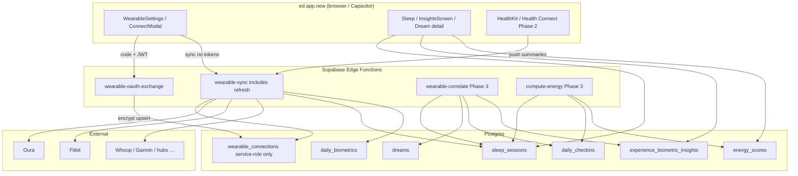
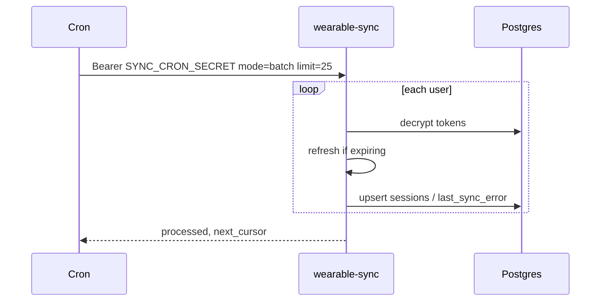

# DESIGN: EverDream Wearables Build-Out

| Field | Value |
|-------|-------|
| **Title** | Wearables Build-Out — Secure Sync, Biometrics, Experience Mapping |
| **Author** | Systems Architecture (Grok Design) |
| **Date** | 2026-07-24 |
| **Revised** | 2026-07-24 (review round 2 — lockdown completeness) |
| **Status** | Draft |
| **Canonical app** | `ed.app.new/` |
| **Repo** | `C:\Users\xaeli\Projects\EverDream` (`xaelistic/EverDream`, branch `main`) |
| **Related specs** | SPEC-13 (partially **superseded**), SPEC-21, SPEC-10 (diverged labeling), SPEC-08 (biometric subset); competitive audit |
| **Secondary path** | `docs/specs/DESIGN-wearables-buildout.md` |

---

## Spec reconciliation

This design is the **implementation authority** for wearables security and sync. Older specs remain historical context.

| Spec | Sections | Status relative to this design |
|------|----------|--------------------------------|
| **SPEC-13** §4 Auth & tokens (return tokens to client, client fetch, paste-token MVP) | §4–7, implementation plan Phase 0–2 | **Superseded** — server-only tokens, edge sync, OAuth-only prod (aligns with SPEC-21) |
| **SPEC-13** data mapping WearableSleepRecord → sleep_sessions | §3 | **Still valid** as starting map; extended here (`provider_scores`, SpO2/temp/resp, calibrated ≠ vendor) |
| **SPEC-13** Oura/Fitbit fetch hardening | §5 | **Implemented via** edge adapters (not browser) |
| **SPEC-21** OAuth-only, no paste | all | **Adopted in full** for production |
| **SPEC-10** readiness “like Oura” | §1 Readiness score | **Intentional divergence**: product is **EverDream energy residual**, not an Oura readiness clone. Table name: `energy_scores` (not `readiness_scores`). UI strings must say “EverDream energy” |
| **SPEC-10** coaching tips, wind-down | later features | **Deferred** post-MVP; out of wearables core |
| **SPEC-08** full pattern extraction, embeddings, RAG | §1–4 | **Out of scope** for this design |
| **SPEC-08** dream ↔ sleep correlations | §2 subset | **In scope** as biometric insight cards only (`experience_biometric_insights`) |

---

## Overview

EverDream already has substantial **scaffolding** for wearables: a large client library (`ed.app.new/src/lib/wearables.ts` ~1237 LOC), a connection service (`wearableService.ts`), an OAuth exchange edge function (`wearable-oauth-exchange`), UI (`WearableSettings.tsx`, `WearableConnectModal.tsx`), and a `wearable_connections` table with RLS. What is missing is a **production-grade pipeline**: server-side sync (to avoid CORS and secret exposure), encrypted tokens (not localStorage), **inline token refresh on the MVP path**, real end-to-end persistence into `sleep_sessions` without mocks, derived sleep/energy fusion scores, and durable experience↔biometric correlation storage.

This design makes EverDream a **complementary** layer to Oura, Whoop, Fitbit, Garmin, and similar apps. We do **not** rebuild vendor readiness UIs, strain coaches, or fitness dashboards. We import objective night metrics (and limited daytime residual signals), fuse them with EverDream’s subjective data (dreams, mood, energy check-ins, reflections), and surface **insightful mappings** for sleep quality, daytime energy, and dream experience.

**Primary outcomes**

1. Secure OAuth-only connect (SPEC-21) for priority providers; tokens never returned to the browser after exchange.
2. Server-side `wearable-sync` with **refresh-on-401 / pro-active refresh** for Oura (and Fitbit) in MVP.
3. Idempotent session upsert keyed primarily by **`external_session_id`** when available.
4. Derived EverDream scores labeled as **ours**; vendor scores only in `provider_scores` — **`calibrated_score` is never a vendor copy**.
5. Batch correlation of experiences to biometrics with concrete v1 insight contracts.
6. **MVP release train = PR-1…PR-6** (schema → encrypt+OAuth contract → sync+refresh+Oura → OAuth UX → Fitbit → mocks+linking). Cron/native/insights later.

---

## Background & Motivation

### Why this change is needed

Wearable data is the credibility bridge between “creative dream journal” and “wellness product.” Competitive positioning in `docs/COMPETITIVE_AUDIT_AND_GAPS.md` explicitly calls out that integration is basic and that EverDream should feel like a hybrid of advanced dream apps + Oura/Whoop **without** becoming either.

### Current state (verified in code)

| Area | Path | Reality |
|------|------|---------|
| Core lib | `ed.app.new/src/lib/wearables.ts` (~1237 LOC) | Providers: `oura`…`sony`. Strongest fetch: Oura/Fitbit/Google Fit; many stubs. Normalized `WearableSleepRecord`. |
| Service | `ed.app.new/src/lib/wearableService.ts` | **Bug A:** provider attribution uses `enabled[0]` for all records. **Bug B:** `fetchAllWearableSleep(enabled.map(c => c.auth), …)` passes `WearableAuth[]` but API expects `WearableConfig[]` — `config.provider` / `config.enabled` are undefined in the switch; service sync path is broken. Upsert `onConflict: 'user_id,sleep_start,wearable_provider'` with **no matching unique index**. Mapping sets `algorithmic_score` **and** `calibrated_score` both to `record.score` (vendor leakage). |
| Settings UI | `WearableSettings.tsx` | Passes full configs correctly to `fetchAllWearableSleep` (works better than service path). |
| OAuth client | `wearableOAuth.ts` | Requires `data.auth.accessToken` in response — must change with hardened edge. |
| Edge OAuth | `wearable-oauth-exchange/index.ts` | Supports `oura`, `fitbit`, `google_fit`, `withings` only. Returns tokens to client. No refresh. CORS hard-coded `https://everdream.n1g3.com`; default redirect `https://everdream.app/wearable-callback`. |
| Token store (client) | `wearableConnectionStore.ts` | **localStorage** keys `everdream_wearable_configs` + `wearable_test_tokens`. |
| Migration | `20250709000001_wearable_connections.sql` | Plaintext tokens; full SELECT RLS for owner; provider CHECK omits whoop/hume/muse/ultrahuman. |
| Social pattern | `social-token-sync` | JWT-bound **server store** of tokens — **plaintext**, not encrypted. Wearables will be **stricter** (add encryption + service-role-only base table). |
| Sleep schema | `sleep_sessions` | Stages, HR/HRV, source, wearable_provider, dream_id. No SpO2/temp/resp columns. |
| Dreams | `dreams.sleep_session_id` | FK exists; reverse `sleep_sessions.dream_id` also exists. |
| Energy | `dailyCheckin.ts` | localStorage only. |
| Mocks | `DreamJournalApp.tsx` | `generateMockSleepData()` in `saveDream`. |
| Feature flags | `config/features.ts` | Compile-time booleans only (`FEATURE_NFT_UI_ENABLED`, …) — **no** % rollout. |
| Insights UI | `screens/InsightsScreen.tsx` | Exists; biometric cards plug in here (Phase 3). |

### Pain points

1. **Security:** tokens in localStorage + plaintext DB; OAuth edge returns secrets; client `.select('*')` on connections.
2. **Architecture:** browser fetch → CORS/rate limits; **no token refresh** anywhere.
3. **Broken sync path:** wrong arg shape + attribution + upsert without unique key + calibrated = vendor.
4. **Product honesty:** mocks, token paste, no complementary copy.
5. **SPEC-13 still documents insecure path** — implementers must follow **this design**, not SPEC-13 §4–7.

---

## Goals & Non-Goals

### Goals

1. Secure connections for **P0: Oura**, then **Fitbit**; Android via **Health Connect native** (Phase 2) rather than deep Google Fit REST as MVP peer.
2. Server-side sync + **MVP token refresh** for Oura/Fitbit.
3. Capture sleep-centric biometrics; vendor scores opaque; EverDream fusion labeled.
4. Durable experience↔biometric insights (v1 contract).
5. OAuth-only UX (SPEC-21); kill production mocks.
6. Native hubs Phase 2; Hume schema-ready without fake APIs.
7. RLS + cascade delete consistent with `profiles.auth_user_id`.

### Non-Goals

- Rebuild Oura/Whoop/Fitbit/Garmin coaching dashboards or strain rings.
- Medical diagnosis / clinical claims.
- Full activity/workout datasets.
- Real-time streaming HR in MVP.
- Full SPEC-08 pattern extraction / embeddings / RAG.
- Invented Hume/Muse REST APIs.
- Cross-user biometric leaderboards.
- Claiming remote % feature rollout without PostHog/allowlist infrastructure.

---

## Proposed Design

### High-level architecture

Prefer **Supabase Edge Functions** + **encrypted tokens server-side only**. Social OAuth (`social-token-sync`) is the pattern for **JWT-bound server storage**; wearables add **encryption** and **REVOKE client access to the base table** (stricter than social).



### Design principle: complementary, not competitive

| EverDream owns | Vendor app owns |
|----------------|-----------------|
| Dream journal, transcripts, interpretations | Device UX, firmware, brand scores |
| Subjective morning/energy check-ins | Live readiness/strain coaching UI |
| Fusion: night biometrics × dream experience | Pure fitness/activity graphs |

**Canonical copy:**  
> Connect your band so EverDream can relate your nights and dreams to body signals — we don’t replace Oura, Whoop, or Fitbit.

---

### A. Provider strategy

#### A.1 Adapter pattern & ownership split

```
ed.app.new/src/lib/wearables/
  types.ts              # shared types only (safe for client)
  index.ts              # re-exports types; no provider HTTP in prod builds
  normalize.ts          # pure normalize for native push payloads
  oauth/urls.ts         # getOAuthUrl (client-safe, no secrets)

supabase/functions/_shared/wearables/
  providers/oura.ts     # Deno owns all cloud HTTP fetch
  providers/fitbit.ts
  refresh.ts            # token refresh helpers
  encrypt.ts            # AES-GCM token crypto
  mapToSession.ts       # mapWearableRecordToSleepSession
```

**Decision (no dual full-stack fetch):** Deno edge **owns** provider HTTP. Client keeps **types** + **OAuth URL builders** + **native push normalize** only. Delete (or DEV-gate) browser `fetchOuraSleep` / `fetchAllWearableSleep` from production bundles once edge sync ships. Do **not** maintain a shared npm package across Vite and Deno for MVP — deliberate dual-home of **types** (copy or thin shared folder) is acceptable; fetch logic lives once (edge).

#### A.2 Direct OAuth vs hub vs aggregator

| Approach | EverDream fit |
|----------|----------------|
| **Direct OAuth** | **Primary for Oura + Fitbit** (MVP). Whoop Phase 2. |
| **HealthKit / Health Connect** | **Primary Android/iOS multi-device** Phase 2 — prefer over deep Google Fit REST. |
| **Terra / Junction** | Optional Phase 3 long-tail only (cost floor). |

#### A.3 Per-provider matrix (revised priorities)

| Provider | Auth | Scopes (target) | Token TTL (typical) | Backfill | Sync | Priority |
|----------|------|-----------------|---------------------|----------|------|----------|
| **Oura** | OAuth2 | daily sleep + related daily scopes | Access ~24h; refresh long-lived | 30–90d | Poll | **P0 MVP** |
| **Fitbit** | OAuth2 (token endpoint often **Basic** auth) | `sleep`, `heartrate` | Access ~8h; refresh long-lived | 30d | Poll | **P0 MVP** (after Oura works) |
| **Google Fit REST** | OAuth2 | sleep + HR read | Access ~1h; refresh | 30d | Poll | **P1 best-effort** — not MVP peer; prefer HC native |
| **Apple Health** | HealthKit native | Sleep, HRV, RHR, SpO2, resp, temp | N/A | On-device | Push summary | **P1 Phase 2** |
| **Health Connect** | Native Android | Sleep + HR series | N/A | On-device | Push summary | **P1 Phase 2** (Android path) |
| **Whoop** | OAuth2 + **rotating** refresh; membership required | sleep, recovery | Access ~1h; rotating refresh | After sleep | Poll + webhooks | **P1 Phase 2** |
| **Garmin** | Health API partner | Sleep, HRV, SpO2, resp | Per agreement | Per agreement | Push/ping | **P2** |
| **Withings / Polar / Ultrahuman** | OAuth / partner | sleep-centric | Varies | 30d | Poll | **P2** |
| **Samsung/Huawei/Xiaomi/Amazfit** | Prefer HC hub | — | — | — | Hub-first | **P2–P3** |
| **Sony / Muse** | No reliable public cloud sleep API | — | — | — | Placeholder / research | **P3** |
| **Hume** | No verified public band sleep API | EDA if partner | TBD | TBD | Partner / hub | **P3 schema-ready** |

#### A.4 Hume Band

No invented APIs. Paths: (1) partner/waitlist, (2) HealthKit/HC if metrics land there, (3) nullable EDA columns + `provider_scores`. UI: “Coming soon” until real.

#### A.5 Extended record type

```ts
export interface WearableSleepRecord {
  date: string;
  bedtime: string;
  wakeTime: string;
  durationMinutes: number;
  remMinutes: number;
  deepMinutes: number;
  lightMinutes: number;
  awakeMinutes: number;
  efficiency: number;
  /** Vendor sleep score if any — never written to calibrated_score */
  score: number;
  heartRateAvg?: number;
  heartRateMin?: number;
  heartRateMax?: number;
  hrv?: number; // RMSSD ms preferred
  respiratoryRate?: number;
  skinTempCelsius?: number;
  skinTempDelta?: number;
  spo2Avg?: number;
  restingHeartRate?: number;
  awakenings?: number;
  wasoMinutes?: number;
  edaAvg?: number;
  stressProxy?: number;
  providerScores?: Record<string, number | string>;
  source: WearableProvider; // must match enum
  externalId?: string;      // provider session id — primary upsert key
}
```

---

### B. What data to store vs derive

#### B.1 Canonical metrics

Sleep window, stages, efficiency, WASO, awakenings, RHR, overnight HR, HRV (RMSSD), resp rate, SpO2, skin temp/delta, optional EDA. Vendor scores → `provider_scores` only. Workouts/strain/steps out of scope.

#### B.2 Storage layers

1. **`sleep_sessions`** — primary nightly rollup (extended columns).
2. **`daily_biometrics`** — calendar-day aggregates.
3. **`daily_checkins`** — promote from localStorage.
4. **`energy_scores`** — EverDream residual energy snapshots (SPEC-10 divergence; **not** named readiness).
5. **`experience_biometric_insights`** — cached insight cards.
6. **`wearable_samples`** — **deferred to Phase 4**; **not** in MVP/PR-1 DDL (avoids TTL cleanup debt).

#### B.3 Derived formulas (v1 — implementable)

##### B.3.1 EverDream sleep quality fusion → writes `calibrated_score`

Reuse weights from `modules/sleep/scoreCalculator.ts` when stages exist. Pure function on edge or shared TS:

```
stageQuality   = f(deep%, rem%)           // same rules as scoreCalculator.scoreStageQuality
continuity     = f(WASO, awakenings)      // scoreContinuity
duration       = f(total_sleep vs 8h)     // scoreDuration
efficiency     = f(sleep_efficiency)      // scoreEfficiency

fusion_raw = 0.35*stageQuality + 0.25*continuity + 0.25*duration + 0.15*efficiency

// Optional subjective blend when user_report_score or morning restedness present:
if user_report_score is set:
  fusion = 0.80*fusion_raw + 0.20*user_report_score
else:
  fusion = fusion_raw

calibrated_score = clamp(round(fusion), 0, 100)
```

**Missing data:** If stages all zero/null, do **not** invent percentages; leave `calibrated_score` null and set only duration/efficiency components that exist. **Never** copy `record.score` into `calibrated_score`.

**Vendor score placement (PR-3 mapping change):**

```ts
algorithmic_score: null, // or omit; do not use for EverDream UI
calibrated_score: computeFusion(record) ?? null,
provider_scores: {
  sleep_score: record.score,
  ...record.providerScores,
},
```

If product still wants a column for “provider algorithmic,” store only inside `provider_scores.sleep_score`. Prefer **not** filling `algorithmic_score` with vendor numbers to avoid UI confusion.

##### B.3.2 EverDream energy residual (v1) → `energy_scores`

Computed for **local calendar day D** using night ending morning of D (session whose local wake date = D).

```
Inputs (all optional; see missing rules):
  S  = calibrated_score for that night (0–100) or fusion_raw
  H  = HRV RMSSD for that night
  H7 = mean HRV of prior 7 nights with HRV (need ≥3 points else skip HRV term)
  R  = resting HR or overnight HR avg that night
  R7 = mean R of prior 7 nights (≥3 else skip)
  E  = daily_checkins.energy for day D (0–100) if present

z_hrv = (H - H7) / max(sd(H7 window), 1)   // clamp z to [-2.5, 2.5]
z_rhr = (R7 - R) / max(sd(R7 window), 1)   // higher RHR than baseline → negative; clamp

// Component scores 0–100:
c_sleep = S                                           // default 50 if S missing
c_hrv   = clamp(50 + 12*z_hrv, 0, 100)                // if HRV term skipped → omit from weight
c_rhr   = clamp(50 + 12*z_rhr, 0, 100)                // if RHR term skipped → omit
c_subj  = E                                           // if no check-in → omit

// Renormalize weights over present components:
// defaults: sleep 0.45, hrv 0.25, rhr 0.15, subj 0.15
energy = weighted_mean(present components)
energy_score = clamp(round(energy), 0, 100)
```

**`components` jsonb shape:**

```json
{
  "sleep": 78,
  "hrv": 62,
  "rhr": 55,
  "subjective": 50,
  "weights_used": { "sleep": 0.45, "hrv": 0.25, "rhr": 0.15, "subjective": 0.15 },
  "hrv_rmssd": 42,
  "hrv_baseline": 38,
  "model_version": "energy_v1"
}
```

UI label: **“EverDream energy”** — never “Readiness” without the EverDream prefix. Acceptance criteria for energy PR: no string “Oura readiness” / bare “Readiness” in user-facing copy.

#### B.4 Mapping & upsert (edge-owned)

**Primary idempotency key (preferred):**

```sql
UNIQUE (user_id, wearable_provider, external_session_id)
-- only for rows where external_session_id IS NOT NULL
```

PostgREST cannot use partial unique indexes in `onConflict`. Therefore:

| Path | Mechanism |
|------|-----------|
| **Edge sync (authoritative)** | Service-role client: prefer raw SQL / RPC `upsert_wearable_sleep_session(...)` that does `INSERT … ON CONFLICT (user_id, wearable_provider, external_session_id) DO UPDATE` when `external_session_id` present; else conflict on full unique `(user_id, wearable_provider, sleep_start_minute)`. |
| **Client** | **Must not** upsert wearable sessions after MVP; only edge writes wearable rows. |

**Fallback key when no external id:**

- Normalize `sleep_start` to **minute precision** (truncate seconds): `date_trunc('minute', sleep_start)`.
- Non-partial unique: `UNIQUE (user_id, wearable_provider, sleep_start)` **only for wearable rows** is hard with nulls — use:

```sql
-- External id path (preferred)
CREATE UNIQUE INDEX uq_sleep_wearable_external
  ON sleep_sessions (user_id, wearable_provider, external_session_id)
  WHERE external_session_id IS NOT NULL AND source = 'wearable' AND is_deleted = false;

-- Fallback minute-normalized start (edge uses RPC, not PostgREST onConflict on partial)
CREATE UNIQUE INDEX uq_sleep_wearable_start_minute
  ON sleep_sessions (user_id, wearable_provider, (date_trunc('minute', sleep_start)))
  WHERE external_session_id IS NULL AND source = 'wearable' AND is_deleted = false;
```

**Edge RPC (authoritative write path — service_role only):**

JWT / cron auth happens **in the Edge Function**, which then calls this RPC with the **service role** key. The function must **not** be executable by `authenticated` / `anon` / `PUBLIC`.

```sql
CREATE OR REPLACE FUNCTION public.upsert_wearable_sleep_session(p jsonb)
RETURNS uuid
LANGUAGE plpgsql
SECURITY DEFINER
SET search_path = public
AS $$
DECLARE
  v_id uuid;
  v_user_id uuid := (p->>'user_id')::uuid;
  v_provider text := p->>'wearable_provider';
  v_ext text := nullif(p->>'external_session_id', '');
  v_start timestamptz := (p->>'sleep_start')::timestamptz;
BEGIN
  -- Defense in depth: only service_role should hold EXECUTE (see GRANT below).
  -- Still require a non-null user_id set by edge from JWT→profile resolution (never trust browser body alone).
  IF v_user_id IS NULL OR v_provider IS NULL OR v_start IS NULL THEN
    RAISE EXCEPTION 'upsert_wearable_sleep_session: user_id, wearable_provider, sleep_start required';
  END IF;

  IF v_ext IS NOT NULL THEN
    INSERT INTO sleep_sessions (
      user_id, wearable_provider, external_session_id, sleep_start, sleep_end,
      source, is_deleted /* + other columns from p */
    )
    VALUES (
      v_user_id, v_provider, v_ext, v_start, (p->>'sleep_end')::timestamptz,
      'wearable', false
    )
    ON CONFLICT (user_id, wearable_provider, external_session_id)
      WHERE external_session_id IS NOT NULL AND source = 'wearable' AND COALESCE(is_deleted, false) = false
    -- If partial unique index cannot be targeted by ON CONFLICT, use unconstrained
    -- unique on (user_id, wearable_provider, external_session_id) for non-null ext ids
    -- or implement as UPDATE-then-INSERT with the unique index enforcing integrity.
    DO UPDATE SET
      sleep_end = EXCLUDED.sleep_end,
      is_deleted = false,
      updated_at = now()
      -- … map remaining metric columns from p
    RETURNING id INTO v_id;
  ELSE
    -- Fallback: match on minute-truncated sleep_start (implement via SELECT FOR UPDATE
    -- on existing row with date_trunc match, else INSERT). Soft-deleted match → undelete.
    -- Exact SQL may use a helper unique index or explicit UPDATE path.
    NULL; -- see migration file in PR-1 for full branch
  END IF;

  RETURN v_id;
END;
$$;

-- CRITICAL privilege lockdown
REVOKE ALL ON FUNCTION public.upsert_wearable_sleep_session(jsonb) FROM PUBLIC;
REVOKE ALL ON FUNCTION public.upsert_wearable_sleep_session(jsonb) FROM anon, authenticated;
GRANT EXECUTE ON FUNCTION public.upsert_wearable_sleep_session(jsonb) TO service_role;
```

**Edge binding rules (mandatory):**

1. `wearable-sync` verifies **user JWT** (interactive) or **`SYNC_CRON_SECRET`** (batch).
2. Resolves `profile.id` from `auth.uid()` (or batch user id from server-side query) — **never** from an untrusted client `user_id` field alone.
3. Builds `p` with that `user_id` and calls RPC with **service role** Supabase client.
4. Do **not** `GRANT EXECUTE … TO authenticated` on this function.

**Pre-migration dedupe (PR-1 step):** SQL script to collapse duplicate `(user_id, wearable_provider, date_trunc('minute', sleep_start))` wearable rows keeping max(updated_at).

**Oura `externalId`:** use session `id` from `/usercollection/sleep` when present; else `daily_sleep` day + provider as synthetic `oura:day:YYYY-MM-DD` only if single main sleep.

---

### C. Experience mapping

#### C.1 Link dreams ↔ nights (timezone-aware)

**User timezone (required for correct linking):**

```sql
ALTER TABLE public.user_settings
  ADD COLUMN IF NOT EXISTS timezone TEXT; -- IANA, e.g. 'America/Los_Angeles'

-- Capture: onboarding, settings, or first client session (Intl.DateTimeFormat().resolvedOptions().timeZone)
```

**Fallback order for interpreting a night:**

1. `sleep_sessions.timezone` (set at sync from user_settings or provider)
2. `user_settings.timezone`
3. Browser-reported TZ at link time (client passes to edge)
4. UTC (last resort — log metric `link_tz_fallback_utc`)

**Dream timestamp preference:** `coalesce(local_created_at, created_at)`.

**Linking rules:**

1. Resolve user TZ; compute local date of dream timestamp.
2. Candidate sessions: wearable (preferred) or any, where local **wake date** = dream local morning date, or local sleep interval covers dream time.
3. **One primary session per local night** = main sleep (longest `total_sleep_minutes`; if tie, wearable over manual).
4. **Multiple dreams** may set `dreams.sleep_session_id` to the same primary session.
5. Set `sleep_sessions.dream_id` only if currently null, to the **first** linked dream (oldest `created_at`); **never** overwrite wearable metric columns when linking.
6. Naps: sessions with `total_sleep_minutes < 180` are secondary; dreams link to nap only if dream time falls inside nap window and no main night matches.

#### C.2 Insight card contract (v1)

**Surface:** `screens/InsightsScreen.tsx` — new section “Body & dreams” cards. Soft language only.

**v1 `insight_type` enum (closed list):**

| insight_type | X (experience) | Y (biometric) | Min n | Min \|r\| |
|--------------|----------------|---------------|-------|-----------|
| `valence_vs_hrv_30d` | `dreams.valence` | night `heart_rate_variability` | 7 | 0.25 |
| `valence_vs_efficiency_30d` | `dreams.valence` | `sleep_efficiency` | 7 | 0.25 |
| `lucidity_vs_rem_30d` | `dreams.lucidity_level` (0–5) | `rem_minutes` | 7 | 0.25 |
| `energy_vs_prior_efficiency_30d` | `daily_checkins.energy` | prior night `sleep_efficiency` | 7 | 0.25 |
| `emotion_intensity_vs_rem_30d` | intensity proxy (below) | `rem_minutes` | 7 | 0.25 |

**Intensity proxy (no DB column):**  
`intensity = clamp(abs(valence) * 50 + (lucidity_level/5)*30 + case category when 'nightmare' then 20 else 0 end, 0, 100)`  
Do **not** require XP helpers for v1.

**Period:** rolling **30 local days** ending yesterday. Recompute on successful sync (debounce 1/hour/user) and nightly batch. Invalidate by upsert same `(user_id, insight_type, period_start, period_end)`.

**Stats jsonb schema:**

```json
{
  "n": 12,
  "r": 0.41,
  "method": "spearman",
  "x_mean": 0.2,
  "y_mean": 48,
  "period_days": 30
}
```

**Algorithm (pure TypeScript in edge — no native deps):** Spearman rank correlation (implement ~40 LOC). Skip Pearson for v1. If `n < 7` or `|r| < 0.25`, **do not write/show** a card (or write with `dismissed`-equivalent `confidence` null and UI hides).

**Example end-to-end (`valence_vs_hrv_30d`):**

```
pairs = []
for each dream in last 30d with valence not null and sleep_session_id set:
  session = sleep_sessions[id]
  if session.heart_rate_variability != null:
    pairs.push({ x: valence, y: hrv })
if pairs.length >= 7:
  r = spearman(pairs)
  if abs(r) >= 0.25:
    upsert insight {
      insight_type: 'valence_vs_hrv_30d',
      title: r > 0
        ? 'Higher HRV nights sat near more positive dream entries'
        : 'Lower HRV nights sat near more positive dream entries',
      body: 'Based on n nights in the last 30 days. Correlation, not causation.',
      stats: { n, r, method: 'spearman', ... },
      confidence: abs(r),
      sample_size: n
    }
```

#### C.3 Surfaces

- InsightsScreen biometric section (Phase 3).
- Sleep dashboard: last night + EverDream energy + “From {Provider}” badges for vendor scores.
- Dream detail: “That night” panel if linked.

---

### D. Architecture

#### D.1 Edge functions

| Function | Role | MVP? |
|----------|------|------|
| **`wearable-oauth-exchange`** | Code→token; **encrypt + store**; return **metadata only**; Fitbit Basic auth on token endpoint | Yes |
| **`wearable-disconnect`** | User JWT; service-role load; best-effort provider revoke; hard DELETE connection; audit event | Yes (PR-2) |
| **`wearable-sync`** | User JWT or cron secret; **proactive refresh if `expires_at < now()+5m`**; on provider 401 refresh once and retry; fetch; upsert via **service_role-only** RPC; update `last_synced_at` / `last_sync_error` | Yes (**includes refresh**) |
| **`wearable-token-refresh`** | Optional standalone for ops; **not required** if refresh fully inlined in sync — implement as **shared module** `_shared/wearables/refresh.ts` called from sync | Yes as module |
| **`wearable-correlate`** | Insight cards | Phase 3 |
| **`compute-energy`** | energy_scores | Phase 3 |

**P0 token TTLs (refresh-in-MVP):**

| Provider | Access TTL | Refresh behavior |
|----------|------------|------------------|
| Oura | ~24 hours | Standard refresh_token grant before expiry / on 401 |
| Fitbit | ~8 hours | Refresh; token endpoint **Authorization: Basic base64(clientId:clientSecret)** |
| Google Fit (if used) | ~1 hour | Refresh with offline scope; not MVP-blocking |

Whoop **rotating** refresh tokens stay Phase 2 (PR-7).

#### D.2 OAuth client contract (co-sequenced)

**Breaking change — ship edge + clients in the same PR (PR-2):**

```ts
// wearableOAuth.ts — NEW contract
export async function exchangeWearableOAuthCode(...): Promise<{
  provider: WearableProvider;
  scopes: string[];
  expires_at: string | null;
  status: 'connected';
}> {
  const { data, error } = await supabase.functions.invoke('wearable-oauth-exchange', {
    body: { provider, code, redirect_uri: redirectUri },
  });
  if (error || !data?.success || !data?.connection) throw ...
  // MUST NOT read data.auth.accessToken
  return data.connection;
}
```

Update together: `wearable-oauth-exchange`, `wearableOAuth.ts`, DreamJournalApp OAuth callback, `WearableSettings` / connect success → **auto-invoke `wearable-sync`**. Intermediate “edge returns metadata but client still expects token” is a **release blocker**.

#### D.3 Interactive vs batch sync auth

**Interactive:**

```
POST wearable-sync
Authorization: Bearer <user JWT>
{ "mode": "user", "provider"?: WearableProvider, "days"?: 30 }
```

**Batch (cron) — not MVP; after refresh proven:**

```
POST wearable-sync
Authorization: Bearer <SYNC_CRON_SECRET>   // Supabase secret, constant-time compare
{ "mode": "batch", "limit": 25, "cursor"?: string }
```

Batch algorithm:

1. Verify cron secret (no user JWT).
2. Select users: `user_settings.wearable_sync = true` AND has non-revoked connection, ordered by `last_synced_at nulls first`, `limit` + cursor.
3. For each user: try/catch sync 7-day window; set `last_sync_error` on failure; never fail whole batch.
4. Concurrency: **sequential or max 3 parallel** to respect provider rate limits and edge wall clock (~150s typical limit — budget **≤100s** CPU, stop with `next_cursor` if approaching).
5. Correlate enqueue: separate invoke or skip in batch (Phase 3).
6. Response: `{ processed, failures, next_cursor }`.

#### D.4 Client after connect

- OAuth redirect + state CSRF.
- Exchange → metadata only; **no** localStorage tokens in prod.
- Connection list: RPC or select from locked-down path returning non-secret columns only.
- Sync: invoke `wearable-sync` only.

#### D.5 Fix known bugs (explicit)

| Bug | Location | Fix |
|-----|----------|-----|
| **A** Provider attribution `enabled[0]` | `wearableService.ts:136` | Use `record.source as WearableProvider` |
| **B** Wrong arg shape `WearableAuth[]` vs `WearableConfig[]` | `wearableService.ts:125–128` | Pass full configs **or** delete client fetch path once edge sync exists (preferred) |
| **C** Upsert without unique / partial index issues | service + SQL | Edge RPC + external_session_id primary key |
| **D** `calibrated_score = record.score` | `mapWearableRecordToSleepSession` | Fusion or null; vendor → `provider_scores` |
| **E** Hard-coded CORS / redirect | edge | `WEARABLE_CORS_ORIGINS`, `WEARABLE_REDIRECT_URI_ALLOWLIST` env |

#### D.6 Kill mocks

`generateMockSleepData` only under `import.meta.env.DEV` or `FEATURE_WEARABLE_SAMPLE_DATA` compile flag (default false). Production save path attaches real linked session summary or omits.

#### D.7 CORS / redirect allowlist (PR-2 required env)

```
WEARABLE_CORS_ORIGINS=https://everdream.n1g3.com,https://everdream.app,http://localhost:5173
WEARABLE_REDIRECT_URI_ALLOWLIST=https://everdream.n1g3.com/,https://everdream.app/,http://localhost:5173/
```

Reject exchange if `redirect_uri` not on allowlist. Document Coolify secret setup in PR-2 description. Known hosts today: production n1g3 (hard-coded CORS), everdream.app (default redirect in edge), local Vite.

---

### E. Product UX & positioning

1. OAuth-only primary CTA; **no production token paste** (SPEC-21). Dev paste: `import.meta.env.DEV && FEATURE_WEARABLE_DEV_TOKEN_PASTE`.
2. Status, last sync, scopes, disconnect, export/delete.
3. Subjective scores primary for dream narrative; objective metrics suggested.
4. Settings subtitle = complementary mission statement.
5. Vendor badges: “Oura score 85” not “Your readiness 85”.
6. Energy UI: **“EverDream energy”** only.

---

### F. Phased delivery (MVP train explicit)

| Phase | PRs | Exit criteria |
|-------|-----|---------------|
| **MVP** | **PR-1 … PR-6** | User connects Oura via OAuth; tokens not in browser; refresh works across day boundary; sessions in DB with correct provider; no prod mocks; Fitbit optional if PR-5 lands same train |
| **Phase 2** | PR-7 Whoop, PR-8 native spike/split | HC/HealthKit path; Whoop recovery in provider_scores |
| **Phase 3** | PR-9 energy, PR-10 insights, PR-11 cron | energy_scores + insight cards + nightly batch |
| **Phase 4** | PR-12 samples/Hume/aggregator | Only if real APIs / demand |

---

### G. Security & Privacy — concrete encryption end-to-end

#### G.1 Chosen encryption path (resolves open debate)

**Decision: AES-GCM-256 in the Edge Function** with key `WEARABLE_TOKEN_KEK` (32-byte secret in Supabase secrets). Store:

- `access_token_enc` = `base64(iv || ciphertext || tag)` or structured `{v:1,iv,ct}`
- `refresh_token_enc` similarly
- `token_key_id` = `'v1'` for rotation

**Why not pgcrypto-only:** Deno would need SQL round-trips for every encrypt/decrypt; AES-GCM in edge is one round-trip on upsert and stays off client. **pgcrypto remains available** for future SQL-side jobs but is **not** the MVP path.

**Dual-read period (PR-2):**

1. On write: always write enc columns; stop writing plaintext after flag `WRITE_PLAINTEXT_TOKENS=false`.
2. On read (edge only): if `access_token_enc` present decrypt; else fallback plaintext `access_token`.
3. Backfill job: encrypt existing plaintext rows.
4. Then NULL plaintext columns; later DROP.

#### G.2 Table lockdown (view alone is insufficient)

```sql
-- After edge uses service role exclusively for secrets:
REVOKE ALL ON TABLE public.wearable_connections FROM authenticated, anon;
GRANT SELECT, INSERT, UPDATE, DELETE ON TABLE public.wearable_connections TO service_role;

-- Client metadata list (no token columns)
CREATE OR REPLACE FUNCTION public.list_wearable_connections()
RETURNS TABLE (
  id uuid, provider text, expires_at timestamptz, scopes text[],
  last_synced_at timestamptz, last_sync_error text, status text
)
LANGUAGE sql
STABLE
SECURITY DEFINER
SET search_path = public
AS $$
  SELECT id, provider, expires_at, scopes, last_synced_at, last_sync_error, status
  FROM wearable_connections
  WHERE user_id IN (SELECT id FROM profiles WHERE auth_user_id = auth.uid())
    AND status IS DISTINCT FROM 'revoked';
$$;

REVOKE ALL ON FUNCTION public.list_wearable_connections() FROM PUBLIC;
GRANT EXECUTE ON FUNCTION public.list_wearable_connections() TO authenticated;
```

Client **`getWearableConnections`** must call this RPC — **never** `.from('wearable_connections').select('*')`.

**Do not claim this matches social encryption** — social stores plaintext; wearables are stricter: *JWT-bound server storage pattern like social-token-sync, plus encryption and service-role-only base table.*

#### G.2.1 Disconnect / delete under lockdown (MVP-required)

After `REVOKE ALL` on the base table, client `.from('wearable_connections').delete()` **stops working**. Disconnect is **required for MVP** (UX + GDPR “right to withdraw connection”), not optional.

**Chosen path (PR-2): Edge function `wearable-disconnect`** — preferred over a bare DELETE RPC so we can best-effort revoke at the provider and emit audit events without exposing tokens to the browser.

```ts
// POST /functions/v1/wearable-disconnect
// Authorization: Bearer <user JWT>
// Body: { provider: WearableProvider }
// → { success: true, status: 'revoked' }
```

**Edge algorithm:**

1. Verify user JWT; resolve `profiles.id` via `auth_user_id = auth.uid()`.
2. Load connection row with **service role** (includes enc tokens).
3. If missing → `{ success: true }` idempotent (already disconnected).
4. **Best-effort provider revoke** (non-blocking on failure):
   - Oura: no standard revoke for all token types — skip or document PAT vs OAuth.
   - Fitbit: `POST https://api.fitbit.com/oauth2/revoke` with Basic client credentials + token.
   - Google: `https://oauth2.googleapis.com/revoke?token=…` when used.
5. **Delete row** (hard delete) **or** set `status = 'revoked'`, null enc token columns, clear refresh — prefer **hard DELETE** for GDPR simplicity on disconnect; CASCADE not needed (no child FK from connections).
6. Emit analytics/log event `wearable_connection_revoked` (no token payload).
7. Return metadata only.

**Client wiring (replace current service):**

```ts
// wearableService.ts — MVP
export async function deleteWearableConnection(
  _profileId: string, // unused; edge binds JWT→profile
  provider: WearableProvider,
): Promise<{ success: boolean; error?: string }> {
  const { data, error } = await supabase.functions.invoke('wearable-disconnect', {
    body: { provider },
  });
  if (error || !data?.success) {
    return { success: false, error: error?.message || data?.error || 'Disconnect failed' };
  }
  // Clear any local connection status cache (never tokens in prod)
  return { success: true };
}
```

**Optional SQL companion** (if a pure-DB delete is needed for admin/scripts — **not** the primary client path):

```sql
CREATE OR REPLACE FUNCTION public.delete_wearable_connection(p_provider text)
RETURNS void
LANGUAGE plpgsql
SECURITY DEFINER
SET search_path = public
AS $$
BEGIN
  DELETE FROM wearable_connections
  WHERE provider = p_provider
    AND user_id IN (SELECT id FROM profiles WHERE auth_user_id = auth.uid());
END;
$$;

REVOKE ALL ON FUNCTION public.delete_wearable_connection(text) FROM PUBLIC;
GRANT EXECUTE ON FUNCTION public.delete_wearable_connection(text) TO authenticated;
-- Prefer edge wearable-disconnect for production UX; RPC is fallback only.
```

**MVP checklist hard step:** Connect Oura → Disconnect → `list_wearable_connections` empty / no row → re-connect works.

#### G.2.2 Client write policy on derived tables

| Table | Client (authenticated) | Writer |
|-------|------------------------|--------|
| `daily_checkins` | full owner CRUD | Client + optional sync of localStorage |
| `daily_biometrics` | **SELECT only** | Edge `wearable-sync` (service role) |
| `energy_scores` | **SELECT only** | Edge `compute-energy` (service role) |
| `experience_biometric_insights` | **SELECT** + dismiss only | Edge `wearable-correlate` INSERT/UPDATE content; client dismiss via RPC |
| `sleep_sessions` (wearable source) | existing owner RLS for manual rows; wearable rows written via service role RPC | Edge |
| `wearable_connections` | no table access; list + disconnect via RPC/edge | Edge |

Dismiss insight RPC (Phase 3; ship SQL in PR-1 so table is ready):

```sql
CREATE OR REPLACE FUNCTION public.dismiss_experience_insight(p_id uuid)
RETURNS void
LANGUAGE plpgsql
SECURITY DEFINER
SET search_path = public
AS $$
BEGIN
  UPDATE experience_biometric_insights
  SET dismissed_at = now(), updated_at = now()
  WHERE id = p_id
    AND user_id IN (SELECT id FROM profiles WHERE auth_user_id = auth.uid());
END;
$$;

REVOKE ALL ON FUNCTION public.dismiss_experience_insight(uuid) FROM PUBLIC;
GRANT EXECUTE ON FUNCTION public.dismiss_experience_insight(uuid) TO authenticated;
```

#### G.3 Threat model (abridged)

| Threat | Severity | Mitigation |
|--------|----------|------------|
| XSS steals localStorage tokens | Critical | Remove client tokens |
| Client SELECT plaintext/enc tokens | High | REVOKE + list RPC only |
| Client spoofs energy/insights/biometrics | High | SELECT-only RLS; edge service-role writes |
| Client calls upsert RPC as another user | Critical | EXECUTE = service_role only; JWT bind in edge |
| Disconnect broken after REVOKE | High | `wearable-disconnect` edge (MVP) |
| KEK leak | Critical | Secrets manager; rotation `token_key_id` |
| Log leakage | Medium | Redact Authorization |
| Cron secret leak | High | Rotate; no user data in cron logs |

GDPR: CASCADE from profiles on account delete; **disconnect** via `wearable-disconnect` (hard delete connection + best-effort provider revoke); export of wearable-derived sleep rows later via authenticated export endpoint.

---

## API / Interface Changes

```ts
// Exchange — metadata only (PR-2)
POST wearable-oauth-exchange
Auth: user JWT
{ provider, code, redirect_uri }
→ { success, connection: { provider, scopes, expires_at, status: 'connected' } }

// Disconnect — MVP required after REVOKE on base table (PR-2)
POST wearable-disconnect
Auth: user JWT
{ provider: WearableProvider }
→ { success: true, status: 'revoked' }
// Edge: JWT→profile, service-role load tokens, best-effort provider revoke,
// hard DELETE connection row, event wearable_connection_revoked

// Sync — user or cron (refresh inside)
POST wearable-sync
Auth: user JWT | SYNC_CRON_SECRET
{ mode: 'user' | 'batch', provider?, days?, limit?, cursor? }
→ user: { success, providers: [{ provider, nights, error? }], sessions_upserted }
→ batch: { processed, failures, next_cursor? }
// Internally: service_role.rpc('upsert_wearable_sleep_session', { p }) with user_id from JWT

// Correlate (Phase 3)
POST wearable-correlate
Auth: user JWT
{ period_days?: 30 }
→ { success, insights_written: number }
// Writes insights with service role only

// Dismiss insight (client; Phase 3 UI)
rpc dismiss_experience_insight(p_id: uuid)  // SECURITY DEFINER, owner-scoped
```

**Client SQL RPCs (authenticated EXECUTE):**

| RPC | Purpose |
|-----|---------|
| `list_wearable_connections()` | Connection status metadata |
| `delete_wearable_connection(provider)` | Optional fallback; prefer edge disconnect |
| `dismiss_experience_insight(id)` | Set `dismissed_at` only |

**Service-role-only RPCs (no authenticated EXECUTE):**

| RPC | Purpose |
|-----|---------|
| `upsert_wearable_sleep_session(p jsonb)` | Wearable sleep upsert |

Provider enum adds: `whoop`, `ultrahuman`, `muse`, `hume`, `health_connect`.

---

## Data Model Changes

### Migration 1 — connections, providers, timezone, dedupe prep

```sql
-- 20260724000001_wearables_secure_connections.sql

ALTER TABLE public.wearable_connections
  DROP CONSTRAINT IF EXISTS wearable_connections_provider_check;

ALTER TABLE public.wearable_connections
  ADD CONSTRAINT wearable_connections_provider_check
  CHECK (provider IN (
    'oura', 'fitbit', 'google_fit', 'apple_health', 'samsung_health',
    'huawei_health', 'xiaomi_mi_fitness', 'garmin_connect', 'withings',
    'amazfit', 'polar', 'sony', 'whoop', 'ultrahuman', 'muse', 'hume',
    'health_connect'
  ));

ALTER TABLE public.wearable_connections
  ADD COLUMN IF NOT EXISTS access_token_enc TEXT,
  ADD COLUMN IF NOT EXISTS refresh_token_enc TEXT,
  ADD COLUMN IF NOT EXISTS token_key_id TEXT DEFAULT 'v1',
  ADD COLUMN IF NOT EXISTS last_synced_at TIMESTAMPTZ,
  ADD COLUMN IF NOT EXISTS last_sync_error TEXT,
  ADD COLUMN IF NOT EXISTS status TEXT NOT NULL DEFAULT 'connected'
    CHECK (status IN ('connected', 'expired', 'revoked', 'error')),
  ADD COLUMN IF NOT EXISTS external_user_id TEXT,
  ADD COLUMN IF NOT EXISTS consent_version TEXT,
  ADD COLUMN IF NOT EXISTS consent_at TIMESTAMPTZ;

-- Nullable plaintext during dual-read (existing NOT NULL access_token: alter carefully)
ALTER TABLE public.wearable_connections
  ALTER COLUMN access_token DROP NOT NULL;

ALTER TABLE public.user_settings
  ADD COLUMN IF NOT EXISTS timezone TEXT;

-- Dedupe script runbook: collapse duplicate wearable sessions before unique indexes (Migration 2)
```

Token REVOKE + `list_wearable_connections()` + optional `delete_wearable_connection` as in §G.2 / §G.2.1 (same migration). Primary disconnect UX is edge `wearable-disconnect` (PR-2).

### Migration 2 — sleep fields + upsert indexes + RPC

```sql
-- 20260724000002_sleep_sessions_wearable_fields.sql

ALTER TABLE public.sleep_sessions
  ADD COLUMN IF NOT EXISTS respiratory_rate NUMERIC(5,2),
  ADD COLUMN IF NOT EXISTS spo2_avg NUMERIC(5,2),
  ADD COLUMN IF NOT EXISTS skin_temp_celsius NUMERIC(5,2),
  ADD COLUMN IF NOT EXISTS skin_temp_delta NUMERIC(5,2),
  ADD COLUMN IF NOT EXISTS eda_avg NUMERIC(8,4),
  ADD COLUMN IF NOT EXISTS resting_heart_rate NUMERIC(5,2),
  ADD COLUMN IF NOT EXISTS provider_scores JSONB NOT NULL DEFAULT '{}'::jsonb,
  ADD COLUMN IF NOT EXISTS external_session_id TEXT,
  ADD COLUMN IF NOT EXISTS timezone TEXT;

-- Prefer external id
CREATE UNIQUE INDEX IF NOT EXISTS uq_sleep_wearable_external
  ON public.sleep_sessions (user_id, wearable_provider, external_session_id)
  WHERE external_session_id IS NOT NULL
    AND source = 'wearable'
    AND COALESCE(is_deleted, false) = false;

CREATE UNIQUE INDEX IF NOT EXISTS uq_sleep_wearable_start_minute
  ON public.sleep_sessions (user_id, wearable_provider, (date_trunc('minute', sleep_start)))
  WHERE external_session_id IS NULL
    AND source = 'wearable'
    AND COALESCE(is_deleted, false) = false;

-- upsert_wearable_sleep_session: full body + REVOKE/GRANT service_role only — see §B.4
-- Do NOT GRANT EXECUTE TO authenticated
```

**Pre-step in PR-1:** dedupe existing wearable rows before creating unique indexes.

### Migration 3 — check-ins, biometrics, energy, insights (+ correct RLS)

```sql
-- 20260724000003_biometrics_insights.sql
-- NOTE: wearable_samples intentionally OMITTED (Phase 4)

CREATE TABLE IF NOT EXISTS public.daily_checkins (
  id UUID PRIMARY KEY DEFAULT gen_random_uuid(),
  user_id UUID NOT NULL REFERENCES public.profiles(id) ON DELETE CASCADE,
  checkin_date DATE NOT NULL,
  mood TEXT,
  energy INTEGER CHECK (energy BETWEEN 0 AND 100),
  energy_level TEXT CHECK (energy_level IN ('good', 'ok', 'low')),
  notes TEXT,
  source TEXT NOT NULL DEFAULT 'app',
  created_at TIMESTAMPTZ NOT NULL DEFAULT now(),
  updated_at TIMESTAMPTZ NOT NULL DEFAULT now(),
  UNIQUE (user_id, checkin_date)
);

CREATE TABLE IF NOT EXISTS public.daily_biometrics (
  id UUID PRIMARY KEY DEFAULT gen_random_uuid(),
  user_id UUID NOT NULL REFERENCES public.profiles(id) ON DELETE CASCADE,
  metric_date DATE NOT NULL,
  wearable_provider TEXT,
  rhr NUMERIC(5,2),
  hrv_rmssd NUMERIC(8,2),
  spo2_avg NUMERIC(5,2),
  skin_temp_delta NUMERIC(5,2),
  respiratory_rate NUMERIC(5,2),
  eda_avg NUMERIC(8,4),
  provider_scores JSONB NOT NULL DEFAULT '{}'::jsonb,
  sleep_session_id UUID REFERENCES public.sleep_sessions(id) ON DELETE SET NULL,
  created_at TIMESTAMPTZ NOT NULL DEFAULT now(),
  updated_at TIMESTAMPTZ NOT NULL DEFAULT now(),
  UNIQUE (user_id, metric_date, wearable_provider)
);

-- EverDream energy residual (SPEC-10 divergence — not "readiness")
CREATE TABLE IF NOT EXISTS public.energy_scores (
  id UUID PRIMARY KEY DEFAULT gen_random_uuid(),
  user_id UUID NOT NULL REFERENCES public.profiles(id) ON DELETE CASCADE,
  score_date DATE NOT NULL,
  score INTEGER NOT NULL CHECK (score BETWEEN 0 AND 100),
  components JSONB NOT NULL DEFAULT '{}'::jsonb,
  recommendations JSONB NOT NULL DEFAULT '[]'::jsonb,
  model_version TEXT NOT NULL DEFAULT 'energy_v1',
  created_at TIMESTAMPTZ NOT NULL DEFAULT now(),
  UNIQUE (user_id, score_date, model_version)
);

CREATE TABLE IF NOT EXISTS public.experience_biometric_insights (
  id UUID PRIMARY KEY DEFAULT gen_random_uuid(),
  user_id UUID NOT NULL REFERENCES public.profiles(id) ON DELETE CASCADE,
  insight_type TEXT NOT NULL,
  period_start DATE NOT NULL,
  period_end DATE NOT NULL,
  title TEXT NOT NULL,
  body TEXT NOT NULL,
  stats JSONB NOT NULL DEFAULT '{}'::jsonb,
  confidence NUMERIC(4,3),
  sample_size INTEGER NOT NULL DEFAULT 0,
  dismissed_at TIMESTAMPTZ,
  created_at TIMESTAMPTZ NOT NULL DEFAULT now(),
  updated_at TIMESTAMPTZ NOT NULL DEFAULT now(),
  UNIQUE (user_id, insight_type, period_start, period_end)
);

CREATE INDEX IF NOT EXISTS idx_daily_checkins_user_date
  ON public.daily_checkins (user_id, checkin_date DESC);
CREATE INDEX IF NOT EXISTS idx_daily_biometrics_user_date
  ON public.daily_biometrics (user_id, metric_date DESC);
CREATE INDEX IF NOT EXISTS idx_energy_scores_user_date
  ON public.energy_scores (user_id, score_date DESC);
CREATE INDEX IF NOT EXISTS idx_exp_insights_user_type
  ON public.experience_biometric_insights (user_id, insight_type);

-- RLS: user-authored vs server-derived (see §G.2.2)
ALTER TABLE public.daily_checkins ENABLE ROW LEVEL SECURITY;
ALTER TABLE public.daily_biometrics ENABLE ROW LEVEL SECURITY;
ALTER TABLE public.energy_scores ENABLE ROW LEVEL SECURITY;
ALTER TABLE public.experience_biometric_insights ENABLE ROW LEVEL SECURITY;

-- daily_checkins: full owner CRUD (user-authored)
CREATE POLICY "Users can view own daily_checkins"
  ON public.daily_checkins FOR SELECT
  USING (user_id IN (SELECT id FROM public.profiles WHERE auth_user_id = auth.uid()));
CREATE POLICY "Users can insert own daily_checkins"
  ON public.daily_checkins FOR INSERT
  WITH CHECK (user_id IN (SELECT id FROM public.profiles WHERE auth_user_id = auth.uid()));
CREATE POLICY "Users can update own daily_checkins"
  ON public.daily_checkins FOR UPDATE
  USING (user_id IN (SELECT id FROM public.profiles WHERE auth_user_id = auth.uid()))
  WITH CHECK (user_id IN (SELECT id FROM public.profiles WHERE auth_user_id = auth.uid()));
CREATE POLICY "Users can delete own daily_checkins"
  ON public.daily_checkins FOR DELETE
  USING (user_id IN (SELECT id FROM public.profiles WHERE auth_user_id = auth.uid()));

-- daily_biometrics: SELECT only for clients (writes = edge service role)
CREATE POLICY "Users can view own daily_biometrics"
  ON public.daily_biometrics FOR SELECT
  USING (user_id IN (SELECT id FROM public.profiles WHERE auth_user_id = auth.uid()));
-- NO insert/update/delete policies for authenticated

-- energy_scores: SELECT only for clients (writes = compute-energy service role)
CREATE POLICY "Users can view own energy_scores"
  ON public.energy_scores FOR SELECT
  USING (user_id IN (SELECT id FROM public.profiles WHERE auth_user_id = auth.uid()));
-- NO insert/update/delete policies for authenticated

-- experience_biometric_insights: SELECT only; dismiss via dismiss_experience_insight RPC
CREATE POLICY "Users can view own experience_biometric_insights"
  ON public.experience_biometric_insights FOR SELECT
  USING (user_id IN (SELECT id FROM public.profiles WHERE auth_user_id = auth.uid()));
-- NO client insert/update/delete policies (prevents spoofed insight cards)
-- dismiss_experience_insight(uuid) SECURITY DEFINER — see §G.2.2

-- Service role bypasses RLS for wearable-sync / compute-energy / wearable-correlate writes.
-- Negative test (PR-1): authenticated JWT must fail INSERT into energy_scores / daily_biometrics / insights.
```

**Writer matrix reminder:** Edge functions authenticate the user (JWT) or cron secret, then use the **service role** client to write derived rows. Clients never insert energy scores or biometrics.

---

## Alternatives Considered

1. **Client fetch + localStorage** — rejected (security/CORS).
2. **Aggregator-first** — deferred Phase 3 cost.
3. **Health hubs only** — Phase 2 complement, not exclusive.
4. **Partial unique + PostgREST onConflict** — rejected; use edge RPC.
5. **pgcrypto encrypt in SQL only** — deferred; AES-GCM in edge is MVP.
6. **Dual full fetch in client and edge** — rejected; edge owns HTTP; client types/native only.

---

## Observability

| Signal | Alert / use |
|--------|-------------|
| `wearable_oauth_success` / `_failure` | Failure rate > 10% / 1h |
| `wearable_sync_duration_ms`, nights, provider | p95 > 15s interactive |
| `wearable_token_refresh_ok` / `_fail` | Spike → status expired |
| `wearable_token_decrypt_fail` | Page security |
| `wearable_connection_revoked` | Audit |
| `wearable_data_export` | GDPR audit |
| `link_tz_fallback_utc` | Fix TZ capture |
| Provider 401 after refresh | Force re-OAuth UX |

Never log tokens. Structured JSON edge logs.

---

## Rollout Plan

**Compile-time kill switches** in `config/features.ts`:

```ts
export const FEATURE_WEARABLES_SERVER_SYNC = true;
export const FEATURE_WEARABLES_OAUTH_ONLY = true;
export const FEATURE_WEARABLE_DEV_TOKEN_PASTE = false; // DEV builds may override
export const FEATURE_WEARABLE_SAMPLE_DATA = false;
export const FEATURE_WEARABLES_INSIGHTS = false; // Phase 3
```

**Staged rollout:** not “5% via features.ts”. Options: (1) PostHog feature flag (app already has `posthog.ts`), or (2) profile allowlist table / admin flag. Document which is chosen in PR-3.

**Rollback:** set `FEATURE_WEARABLES_SERVER_SYNC = false`; do not re-enable localStorage tokens.

**Privacy:** update `public/privacy.html` + consent copy in a dedicated PR (PR-2b / legal) before public marketing of wearables.

---

## Testing

| Layer | Coverage | Owner PR |
|-------|----------|----------|
| **Vitest** | `normalize`, `mapWearableRecordToSleepSession` (calibrated ≠ vendor), fusion formula, energy_v1, spearman, dream-night link with TZ fixtures | PR-3, PR-6, PR-9, PR-10 |
| **Deno edge tests** | Mock provider HTTP; Oura map + externalId; refresh-on-401; Fitbit Basic token exchange | PR-2, PR-3, PR-5 |
| **SQL** | Dedupe script dry-run; unique index insert conflicts; RLS negative (authenticated cannot SELECT token table) | PR-1, PR-2 |
| **Manual MVP checklist** | Staging Oura: (1) connect OAuth (2) no token in Application localStorage (3) sync → sleep_sessions row (4) next-day refresh still works (5) **disconnect** → connection gone via list RPC + row absent (6) re-connect works | MVP exit |
| **RLS negative** | Authenticated cannot INSERT into `energy_scores` / `daily_biometrics` / `experience_biometric_insights`; cannot EXECUTE `upsert_wearable_sleep_session` | PR-1 / PR-3 |
| **Prod build** | Assert `generateMockSleepData` not reachable from save path when `import.meta.env.PROD` | PR-6 |

---

## Key Decisions

| Decision | Rationale |
|----------|-----------|
| Refresh **inside** wearable-sync for MVP | Tokens expire; MVP E2E is false without it |
| external_session_id primary upsert; edge RPC | PostgREST + partial indexes unreliable; sleep_start jitter |
| AES-GCM edge + REVOKE base table | Implementable; stricter than social plaintext |
| Disconnect via `wearable-disconnect` edge | Client table DELETE broken after REVOKE; MVP-required |
| Derived tables SELECT-only for clients | Prevent spoofed energy/insights/biometrics |
| `upsert_wearable_sleep_session` EXECUTE = service_role only | Avoid SECURITY DEFINER privilege escalation |
| Edge owns fetch; client types/native only | Avoid dual CORS-prone fetch |
| Google Fit demoted from MVP peer | Sunsetting; HC native better ROI |
| `energy_scores` not `readiness_scores` | Avoid Oura-clone naming |
| calibrated_score = fusion or null only | Vendor scores stay in provider_scores |
| user_settings.timezone | Linking without wrong UTC nights |
| OAuth contract co-shipped | Prevent broken intermediate clients |
| MVP = PR-1…6 | Cron/native/insights not required for exit |
| wearable_samples deferred | No TTL cleanup debt in PR-1 |
| Spearman pure TS | No edge native deps for insights |
| Multi-provider nights: fuse for product views | Product decision 2026-07-24: store all provider rows; dream link + fusion/energy use one fused night (priority-weighted stages; prefer best HRV source); optional side-by-side later |
| Energy freemium default | Market-typical: free headline score; Pro advanced insights/breakdowns (confirm at PR-9/10) |

---

## PR Plan

**Note:** “Independently mergeable” is **not** claimed for the full chain. **MVP train is sequential PR-1→PR-6.** Later PRs depend on MVP.

### MVP train

#### PR-1: Schema + RLS + dedupe
- **Title:** `feat(db): wearable schema extensions, energy/insights tables, RLS, dedupe`
- **Files:** migrations 1–3 (without samples); dedupe script; `user_settings.timezone`
- **Deps:** none
- **Desc:** Provider CHECK expand; enc columns; sleep columns; unique indexes after dedupe; upsert RPC **EXECUTE = service_role only**; daily_checkins full CRUD RLS; **daily_biometrics / energy_scores / insights SELECT-only** + `dismiss_experience_insight`; indexes for correlate.

#### PR-2: Encrypt + OAuth store + client contract + CORS env + disconnect
- **Title:** `feat(wearables): encrypted tokens, metadata-only OAuth, lockdown connections, disconnect`
- **Files:** edge `wearable-oauth-exchange`; edge **`wearable-disconnect`**; `_shared/wearables/encrypt.ts` + refresh helpers; `wearableOAuth.ts`; DreamJournalApp callback; `wearableConnectionStore.ts` (no tokens); `wearableService` → `list_wearable_connections` + `deleteWearableConnection` → disconnect edge; REVOKE grants; env allowlists
- **Deps:** PR-1
- **Desc:** AES-GCM; dual-read; list RPC; **no accessToken in response**; **disconnect path under REVOKE** (best-effort provider revoke + hard delete); auto-sync hook ready. Privacy/consent copy touch if required for ship.

#### PR-3: wearable-sync + refresh + Oura + bugfixes
- **Title:** `feat(wearables): server sync with refresh, Oura adapter, correct mapping`
- **Files:** `wearable-sync`; oura provider; mapToSession (attribution, calibrated, provider_scores, externalId); WearableSettings invoke edge; delete/stop service client fetch path
- **Deps:** PR-2
- **Desc:** Proactive + 401 refresh for Oura; RPC upsert; fixes bugs A–D; vitest + deno tests; FEATURE flags.

#### PR-4: OAuth-only UX (SPEC-21)
- **Title:** `fix(wearables): remove production token paste; complementary copy`
- **Files:** WearableConnectModal, wearableConnectGuides, settings subtitle
- **Deps:** PR-2 (ideally after PR-3 for sync feedback)
- **Desc:** Production paste removed; DEV flag only.

#### PR-5: Fitbit adapter (+ optional Google best-effort)
- **Title:** `feat(wearables): Fitbit server adapter and token Basic auth`
- **Files:** fitbit provider; oauth exchange Fitbit Basic; tests
- **Deps:** PR-3
- **Desc:** Fitbit P0 complete. Google Fit REST optional/best-effort only.

#### PR-6: Kill mocks + dream linking + timezone capture
- **Title:** `fix(wearables): remove prod mock sleep; link dreams to nights`
- **Files:** DreamJournalApp, link helper, settings timezone persist
- **Deps:** PR-3
- **Desc:** MVP exit with real data + links. **Required for MVP release train.**

### Post-MVP

#### PR-7: Whoop + rotating refresh
- **Deps:** PR-3  
- Whoop adapter; rotating refresh token handling.

#### PR-8: Native hubs (spike then implement)
- **Title:** `spike/feat(wearables): HealthKit + Health Connect bridges`  
- Split: 8a spike/Capacitor plugin choice + privacy nutrition labels; 8b implement push-to-sync. **Large** — not undersized as a single drive-by PR.

#### PR-9: EverDream energy (`energy_scores`)
- Formula energy_v1; promote dailyCheckin to DB; Sleep UI strings “EverDream energy”.

#### PR-10: Correlation insights
- `wearable-correlate`; InsightsScreen cards; contracts from §C.2.

#### PR-11: Nightly batch cron
- **Deps:** PR-3 + proven refresh; rate-limit budgets  
- Cron secret batch mode; observability; **after** MVP.

#### PR-12: Phase 4 samples / Hume / aggregator
- wearable_samples + cleanup job; Hume when real; Terra optional.

#### PR-legal: Privacy & consent
- `privacy.html`, in-app consent version strings — before public wearables marketing (can parallel PR-2).

---

## Risks

| Risk | Severity | Mitigation |
|------|----------|------------|
| Token expiry without refresh | Critical | Refresh in PR-3/sync |
| sleep_start jitter duplicates | High | external_session_id + minute truncate |
| PostgREST partial unique | High | Edge RPC |
| Google Fit sunset | Medium | Demote; HC Phase 2 |
| Whoop membership empty data | Medium | UX message |
| KEK loss | Critical | Backup/rotation runbook |
| Spurious correlations | Medium | n≥7, \|r\|≥0.25, soft copy |
| Edge timeout on batch | Medium | cursor + limit 25, ≤100s |
| Dirty data vs unique index | Medium | Dedupe in PR-1 |
| SPEC-13 insecure path followed | Medium | Spec reconciliation table |

**Latency:** OAuth exchange < 2s p95; interactive 30d Oura sync < 15s p95.

---

## Open Questions

1. **PostHog vs profile allowlist** for staged wearables enablement after MVP? *(flags mechanism settled for kill switches; % rollout tool TBD)*
2. **Legal owner** for privacy.html / consent copy before marketing?
3. **Capacitor iOS timeline** alignment with PR-8?
4. **Multi-provider same night:** **Resolved — merge into one fused night** for dream linking and fusion scores. Still **store raw provider rows** (unique per `wearable_provider` + `external_session_id`) for audit/debug; compute a **primary fused view** (stages weighted by sourcePriority when both present; prefer Oura HRV/temp when both; never average vendor readiness scores). Dream link and `calibrated_score` / energy attach to the fused night, not a single vendor row. Side-by-side “compare bands” is optional post-MVP UI.
5. **EverDream energy Pro-gated?** **Guidance (market-typical):** free connect + free headline EverDream energy / sleep fusion; Pro for advanced insight cards, multi-week trends, and factor breakdowns. Matches Fitbit Premium / Sleep Cycle Premium / Oura membership (insights behind paywall, not the raw band connection). Confirm before PR-9/10 ship.

*Resolved in this revision:* encryption path (AES-GCM edge); CORS env vars; MVP refresh; upsert strategy; Google Fit priority; table name `energy_scores`; social comparison accuracy; multi-provider night = fuse for product views.

---

## References

### Internal

- `docs/specs/SPEC-13-wearable-integration.md` (**§4–7 superseded**)
- `docs/specs/SPEC-21-wearables-oauth-flow.md`
- `docs/specs/SPEC-10-sleep-coaching-readiness.md` (label divergence)
- `docs/specs/SPEC-08-patterns-correlations.md` (biometric subset only)
- `docs/COMPETITIVE_AUDIT_AND_GAPS.md`
- `ed.app.new/src/lib/wearables.ts`, `wearableService.ts`, `wearableOAuth.ts`, `wearableConnectionStore.ts`
- `ed.app.new/src/config/features.ts`, `screens/InsightsScreen.tsx`
- `ed.app.new/src/modules/sleep/scoreCalculator.ts`
- `ed.app.new/supabase/functions/wearable-oauth-exchange/index.ts`
- `ed.app.new/supabase/functions/social-token-sync/index.ts` (JWT bind pattern only)
- `ed.app.new/supabase/migrations/20250709000001_wearable_connections.sql`

### External

- Oura Cloud API v2, Fitbit Web API, Whoop Developer, Garmin Health API, HealthKit, Health Connect

---

## Appendix: OAuth sequence (target)

```mermaid
sequenceDiagram
  participant U as User
  participant App as EverDream SPA
  participant Prov as Provider OAuth
  participant Ex as wearable-oauth-exchange
  participant DB as wearable_connections
  participant Sync as wearable-sync

  U->>App: Connect Oura
  App->>Prov: authorize + state
  Prov->>App: code
  App->>Ex: code + JWT
  Ex->>Prov: token exchange
  Ex->>DB: encrypt tokens service-role
  Ex-->>App: connection metadata only
  App->>Sync: sync days=30
  Sync->>DB: decrypt; refresh if needed
  Sync->>Prov: fetch sleep
  Sync->>DB: upsert via RPC
```

## Appendix: Nightly batch (post-MVP)



---

*End of design document (revision 1).*
