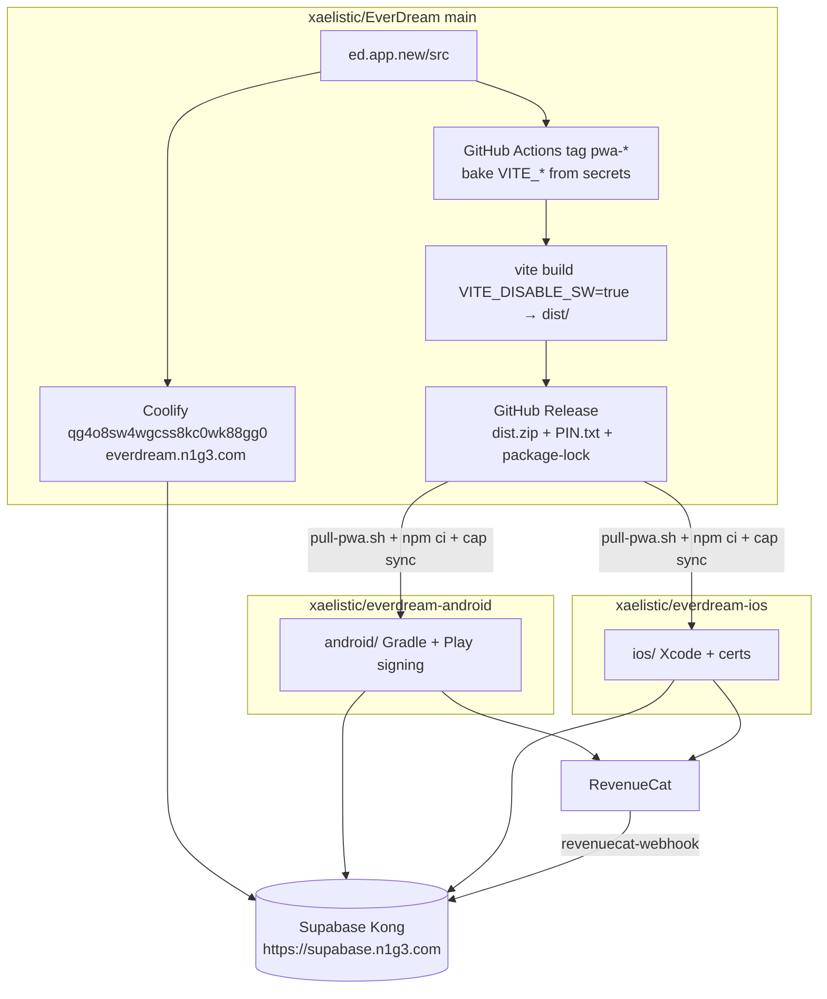
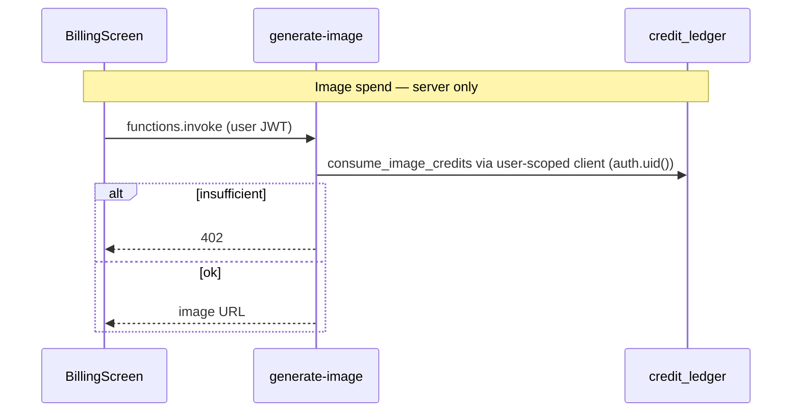

# EverDream Store Apps: PWA Master, Android/iOS Branches

| Field | Value |
|-------|-------|
| **Title** | EverDream Store Apps — PWA is Master; Android and iOS are Branches |
| **Author** | Systems Architecture |
| **Date** | 2026-08-23 |
| **Revised** | 2026-08-23 (owner answers: bundle ID, personal store accounts, legal contact, wearables) |
| **Status** | Draft |
| **Canonical product** | `ed.app.new/` in `xaelistic/EverDream` (`main`) |
| **Live PWA** | `https://everdream.n1g3.com` (Coolify uuid `qg4o8sw4wgcss8kc0wk88gg0`, base directory `/ed.app.new`) |
| **Backend** | Self-hosted Supabase `supabase-everdream-live` (`w9b3r7ces8npevhqcjwn4lzk`). Public Kong URL is Coolify build-arg `VITE_SUPABASE_URL` (Traefik `https://supabase.n1g3.com`, **not** `:8000`). |
| **Related** | SPEC-07, SPEC-13, SPEC-21, `DESIGN-wearables-buildout.md`, `docs/coolify-go-live-checklist.md` (stale name `supabase-test`, dated 2026-07-02 — do not copy into store review notes), `docs/SECURITY_REDTEAM_2026-08-23.md` |

---

## Overview

EverDream is a hash-router PWA (`ed.app.new`, package `everdream-journal@0.2.0`) that already ships the journal, capture, analysis, image generation, phone night tracking, Stripe billing, and a partial Capacitor stack. The product request of 2026-08-23 is explicit: **finalise the PWA as master**, then produce **two store-submittable native codebases** that are **branches of that frozen core**, not a second journal rewrite.

This design freezes a Core App checklist against the current tree, then recommends **Capacitor native shells in two separate GitHub repos** (`xaelistic/everdream-android`, `xaelistic/everdream-ios`) that **vendor a tagged PWA release**. Shared product brain stays in `ed.app.new/src` on `main`. Native-only work (IAP, HealthKit/Health Connect, local notifications, store metadata, signing) lives in the store repos. A small `src/lib/native/` bridge on master keeps web paths working when `Capacitor.isNativePlatform()` is false.

Store **v1** native extras: RevenueCat IAP, HealthKit + Health Connect **sleep-session import**, local morning notifications, share sheet, deep links, splash/safe-area. **Not** in v1: remote push, custom background-sleep plugins, NFT/VR/mesh/skins, Meta login on iOS.

Fully separate Kotlin/Swift rewrites and a React Native remake are rejected for v1. Capacitor is already half-adopted (`@capacitor/core` ^8.4.0, Share, LocalNotifications, RevenueCat) but **no `android/` or `ios/` tree is committed**, and `@capacitor/cli`, `@capacitor/android`, and `@capacitor/ios` are not in `package.json`.

---

## Background & Motivation

### Why this change is needed

Store presence is a go-live item in `docs/coolify-go-live-checklist.md` §7. **Decided 2026-08-23:** Apple Developer and Google Play Console are **personal** accounts (not org / no D-U-N-S). Shells can compile immediately; store upload, IAP products, and SIWA proceed under those personal accounts. Phone sleep tracking (`PhoneNightTracker`, `modules/sleep/motionSensor.ts`) and HealthKit (SPEC-13) are weak or impossible as a browser tab: DeviceMotion and `getUserMedia` stop when the screen is off; Apple Health has no web API (`wearables.ts` documents a placeholder `https://api.apple-health.example.com/v1`). Apple will reject Stripe-sold digital goods inside an iOS binary (guideline 3.1.1). The PWA is the working product; the stores need **shells**, not a second app.

### Current state (verified in code)

| Area | Path | Reality |
|------|------|---------|
| Product | `ed.app.new/` | Vite 8 + React 18 SPA, hash router `useHashRoute.ts`. Screens: Home, Journal, Record, Tracker, More, Billing, Education, Privacy, Wearables. |
| Live deploy | Coolify `qg4o8sw4wgcss8kc0wk88gg0` | Git `xaelistic/EverDream` `main`, Dockerfile multi-stage → nginx, FQDN `https://everdream.n1g3.com`, last online 2026-08-23. Build-time env: `VITE_SUPABASE_URL`, `VITE_SUPABASE_ANON_KEY` only (`inject_build_args_to_dockerfile: true`). |
| PWA | `vite.config.ts` `VitePWA`, `public/manifest.json` | Standalone, portrait, shortcuts `#/record` and `#/journal`. **Name split:** public manifest “EverDream — Dream Journal”; Vite plugin `name: 'Lucid — Dream Journal'`. |
| Auth | `FEATURE_REQUIRE_AUTH = true`, `ProtectedRoute.tsx` → `LoginScreen.tsx`, PKCE in `supabase/client.ts` | Email/password + Google + Meta via `signInWithOAuth` + `getAuthCallbackUrl()` (`window.location.origin`). `socialAuth.ts` types `'apple'` but LoginScreen does not show it. `EnhancedAuth.tsx` has Apple chrome but is not the production gate. |
| Capture | `RecordScreen.tsx`, `VideoCaptureFlow.tsx` | `navigator.mediaDevices.getUserMedia` for mic/camera. |
| Pipeline | `dreamPipeline.ts`, `dreamBackgroundProcessor.ts`, `stuckDreamProcessor.ts` | Analyze via `analyze-dream`, images via `generate-image`, transcribe via `transcribe-audio`. Client `dreamAssetGenerator.ts` calls `consumeImageCredits(1)` **then** `functions.invoke('generate-image')`. Edge function itself does **not** debit. |
| Offline | `lib/storage/indexedDB.ts` | DB `everdream_local` v1, 35-day TTL, local-first dreams/sleep. |
| Sleep | `PhoneNightTracker.tsx`, `useSleepModule.ts`, `nightSleep.ts`, `dailyCheckin.ts` | Foreground DeviceMotion + mic. Sessions in `localStorage` key `sleep_completed_sessions`. |
| Wearables | `wearables.ts`, `wearableConnectionStore.ts`, `wearable-oauth-exchange` | OAuth providers exist; tokens still in localStorage. `fetchAppleHealthSleep` hits a placeholder host if called. |
| Billing web | `BillingScreen.tsx` → `stripe.ts` | Plus $5.99 / Pro **$12.99**. `subscriptionService.getOfferings()` and `ProfileAndSettings.tsx` still list Pro **$9.99**. Credit packs `pack_20/60/150`. |
| Credits | `creditService.ts`, `20260823000001_*` + `20260824000001_free_starter_credits.sql` | Server ledger. Free = **one-time 14 purchased credits**, monthly allotment 0. Plus 40 / Pro 120 monthly. |
| Capacitor | `capacitor.config.ts`, `package.json` scripts `cap:*` | `appId: 'com.everdream.app'`, `webDir: 'dist'`, `androidScheme: 'https'`. **No generated native projects. No `@capacitor/cli` / android / ios packages.** Commented live-reload `server.url` only. |
| Native JS already | `shareService.ts`, `revenuecat.ts`, `PhoneTestTools.tsx` | `Capacitor.isNativePlatform()` gates Share, RevenueCat, local notifications. |
| RevenueCat | `@revenuecat/purchases-capacitor` ^13.1.7, `revenuecat-webhook` | Entitlements `plus` / `pro`. Writes `profiles.subscription_*`. Does **not** `grant_purchased_credits`. |
| Legal | `public/privacy.html`, `public/terms.html` | Last updated May 2026. Mentions optional wearable sleep, 13+, erasure “within 30 days”. Currently cites `privacy@everdream.app` — **that mailbox is not live.** Store/legal primary contact is **`https://everdream.n1g3.com`**. **Missing:** HealthKit, IAP/RevenueCat, local notifications, mic/camera, Stripe, in-app deletion. |
| Account delete | `DreamJournalApp.tsx` `deleteAllUserData` | **Local keys only.** No `signOut`. `subscription_events.user_id` is `ON DELETE SET NULL` (`005_subscriptions.sql`). Storage objects under `dream-media` `{auth_uid}/…`. |
| Crash reporting | `ErrorBoundary.tsx`, `logger.ts` | Console + 2000-entry localStorage ring. **No Sentry.** PostHog optional via `VITE_POSTHOG_*`. |
| Dev tools | `PhoneTestTools.tsx` | Returns `null` when `!DEV`, but `App.tsx` **statically imports** it. Module-scope `TEST_ACCOUNTS` includes `EverDream!Test2026`. |
| Feature flags | `src/config/features.ts` | NFT / mesh / VR / skins UI **off**. Auth required **on**. |
| Recovery route | `urlCleanup.ts` sets `#/reset-password`; `ProtectedRoute` uses `isRecoveryMode` | `useHashRoute.ts` has **no** `reset-password` screen type. |
| Gitignore | repo root + `ed.app.new` | Do **not** ignore `android/` / `ios/`. |

### Pain points

1. Capacitor is a stub: scripts exist, native trees do not.
2. Store policy gaps: in-app account deletion, IAP, privacy nutrition, SIWA.
3. Sleep tracking as a PWA cannot survive screen-off; HealthKit is a documented placeholder.
4. Billing UI always opens Stripe (`BillingScreen.tsx` calls `startStripeCheckout` directly).
5. Product naming and prices are inconsistent (EverDream vs Lucid; Pro $12.99 vs $9.99).
6. A tag-built `dist` without Coolify’s `VITE_*` is an unauthenticated placeholder app (`client.ts` falls back to `https://placeholder.supabase.co`).
7. Edge CORS allow-lists omit Capacitor origins (`https://localhost`, `capacitor://localhost`).

---

## Goals & Non-Goals

### Goals

1. Freeze a **Core App** on PWA `main` that is the single product brain.
2. Produce two **store-submittable** native projects (Play + App Store) that wrap that brain.
3. Keep one journal UI. Core product changes land on `main` and flow into store builds via a tagged release, without rewriting capture/journal/tracker.
4. Native **v1** capabilities: IAP (RevenueCat), HealthKit + Health Connect **sleep import**, **local** notifications, share sheet, deep links, store chrome (splash, icons, safe area, privacy manifests). Sign in with Apple on iOS.
5. Server remains the credit and entitlement source of truth. **`generate-image` is the only image-credit debit.**

### Non-Goals (v1 store apps)

- NFT / XAEL exchange / mesh / WebXR (`FEATURE_*` already false).
- Rewriting the SPA in Kotlin, Swift, or React Native.
- Loading the live PWA URL inside a WebView as the shipping binary (see Key Decisions). Setting Capacitor `server.hostname` to `everdream.n1g3.com` **is not** a remote load — `webDir` remains bundled `dist`.
- Remote push (FCM/APNs) and a custom `BackgroundSleep` plugin. v1 phone tracking stays **foreground** (app open / charger), plus local notifications.
- Shipping all 12 wearable OAuth providers at native-grade quality. **Store v1 does keep** Oura / Fitbit / Google Fit OAuth in the WebView (same as the PWA). Token-paste stays hidden. Do not hide the wearable UI.
- Turning EverDream into a medical device or “Oura clone”.
- Discord bot, `exchange-web/`, Hardhat contracts.
- Meta / Facebook login on iOS.

---

## Proposed Design

### A. Core App Freeze (master PWA)

Cut store **internal** binaries from tag `pwa-1.0.0` only after the **tag bar** below is true on production `https://everdream.n1g3.com` **and** in the GitHub Release `dist.zip` (same `VITE_*` as Coolify). Native shells do not compensate for a broken journal.

There is **one** tag bar. Dogfood/CI verification of already-shipped behaviour is not a tag blocker. F17 (reviewer account) is **store-submit**, not tag.

#### Already true — verify in CI / dogfood (do not block `pwa-1.0.0` on new work)

| # | Gate | Evidence | Verify |
|---|------|----------|--------|
| F1 | Auth required on PWA; email/password + Google + Meta; PKCE; no tokens left in the URL | `ProtectedRoute.tsx`, `FEATURE_REQUIRE_AUTH`, `lib/auth/redirects.ts` | Fresh PWA user can sign up and land in Home. **Native auth is a separate gate (N1), not F1.** |
| F2 | Text / audio / video capture → journal | `RecordScreen.tsx`, `VideoCaptureFlow.tsx`, `dreamBackgroundProcessor.ts` | Each mode reaches `complete` or `failed`. |
| F3 | Stuck journals recoverable | `stuckDreamProcessor.ts` | Reprocess or retry CTA. |
| F5 | Free = one-time 14 starter, no monthly refill | `20260824000001_free_starter_credits.sql`, `FREE_STARTER_CREDITS = 14` | New profile `purchased_credits = 14`, `monthly_credit_allotment = 0`. |
| F7 | Offline IndexedDB + sync | `lib/storage/indexedDB.ts`, `useDreamSync.ts` | Airplane-mode capture; reconnect syncs. |
| F8 | Phone night tracking **while app is open** | `PhoneNightTracker.tsx` | Start → samples → “I’m awake” writes `sleep_completed_sessions`. |
| F9 | Morning feeling check-in | `dailyCheckin.ts` | Today’s check-in on tracker / analysis. |
| F10 | Hash routes for primary surfaces | `useHashRoute.ts`, `Shell.tsx` | `#/`, `#/journal`, `#/record`, `#/tracker`, `#/billing`, `#/privacy`, `#/wearables`. |

#### Must implement before tag `pwa-1.0.0` (the tag bar)

| # | Gate | Owner PR | Done when |
|---|------|----------|-----------|
| F4 | **`generate-image` is the only credit debit** | PR 1a | Edge verifies JWT (`auth.getUser`), rejects missing/anon (401), then calls `consume_image_credits` with the **caller JWT** (not service-role — the RPC keys off `auth.uid()`). HTTP 402 when `ok = false`. Service-role remains OK only for `persistGeneratedImage` bytes. Client does **not** call `consumeImageCredits`. Tests: 0 credits → fail, ledger unchanged; 1 credit → −1 **once**. |
| F6 | Web Stripe Plus/Pro + packs; **Pro is $12.99** everywhere | PR 1a | `BillingScreen`, `getOfferings()`, `ProfileAndSettings.tsx`, Stripe Price, RC product catalog all say **$12.99/mo**. Plus stays **$5.99**. Packs unchanged. |
| F11 | Legal URLs + store disclosures | PR 1c | `https://everdream.n1g3.com/privacy.html` and `/terms.html` include the F11 checklist below. Erasure is **immediate in-app**, not “within 30 days”. |
| F12 | In-app account deletion hits **auth + storage + cascade** | PR 1b | Signed-in user from More → Privacy deletes GoTrue user, storage objects, and profile graph; then local wipe + `signOut`. |
| F13 | Data export is complete enough for GDPR/portability | PR 1b | JSON named `everdream-full-export-YYYY-MM-DD.json`; remote dreams + sleep_sessions; tier + credit remaining; processors list (not “Claude / local only”). |
| F14 | Production crash reporting | PR 1e | Sentry (or equivalent) from `ErrorBoundary` + `logger.error`, tag `platform` via `getPlatform()`, PII stripped. |
| F15 | Product identity + store-safe Billing copy | PR 1c | One name **EverDream** (`manifest.json` and VitePWA `name: 'EverDream — Dream Journal'`). Viewport-fit. No “VR / simulacra / API access / unlimited images” on Billing or Profile. 1024×1024 icon committed. |
| F16 | Path aliases + well-known association files | PR 1d | Alias map below. `public/.well-known/apple-app-site-association` and `assetlinks.json` served as static files with **nginx `Content-Type: application/json`** (extensionless AASA is otherwise octet-stream). `#/reset-password` is a real route. |
| F18 | Dev credentials never ship in production JS | PR 1c | Dynamic `import()` of `PhoneTestTools` behind `import.meta.env.DEV`. CI grep fails if `dist` contains `EverDream!Test2026`. |
| F19 | Tag CI bakes the same `VITE_*` as Coolify | PR 0 | Tag job fails if `VITE_SUPABASE_URL` empty or contains `placeholder`. `PIN.txt` records **which keys were present**, never secret values. |

**Not in the tag bar**

| # | Gate | When |
|---|------|------|
| F17 | Reviewer demo account | PR 9 (store submit). Seed `reviewer@everdream.app` (or similar), 3 dreams, one phone-sleep session, 14 credits, **not** admin. |
| N1 | Native auth (email in WebView, Google redirect, **SIWA on iOS**, hide Meta on iOS) | PR 3, **before TestFlight**. JS must be in a tagged dist (`pwa-1.0.1` if 1.0.0 already cut). |

#### F11 disclosure checklist (`privacy.html` / `terms.html`)

Must name: microphone; camera; device motion; HealthKit / Health Connect sleep (optional, not sold, not diagnostic); Oura / Fitbit / Google Fit OAuth when the user connects them; local notifications; Stripe (web); RevenueCat / Apple / Google Play (native IAP); Supabase hosting; AI processors used by `analyze-dream` / `generate-image` / `transcribe-audio`; in-app account deletion (**immediate** server erase, not 30 days); children 13+; no location permission.

**Primary contact** for privacy/terms and App Store / Play support: **`https://everdream.n1g3.com`**. Do **not** list `privacy@everdream.app` as the primary contact (mailbox is not live). Optional: “contact via the website” only.

#### Can land only in native shells (not PWA tag bar)

- HealthKit (iOS) and Health Connect (Android) **sleep** import (PR 7). Oura / Fitbit / Google Fit OAuth already ship in the PWA WebView and stay in store v1 (KD 19).
- App Store / Play IAP via RevenueCat, including credit consumables (PR 6).
- Local notifications for morning capture (PR 8). **No** FCM/APNs in v1.
- Status bar, splash, safe-area, adaptive icons, iOS privacy manifest, Play 16 KB page-size / targetSdk 35.
- Store listing, screenshots, Data Safety / nutrition labels (PR 9).

#### Explicitly out of v1 store apps

| Flag / surface | File | Store v1 |
|----------------|------|----------|
| `FEATURE_NFT_UI_ENABLED` | `features.ts` | Off. |
| `FEATURE_MESH_UI_ENABLED` | | Off. |
| `FEATURE_VR_UI_ENABLED` | `DreamVRScreen.tsx` | Off. Strip Pro copy that promises VR. |
| `FEATURE_SKINS_UI_ENABLED` | `MoreScreen.tsx` | Off. |
| Token-paste wearable debug | SPEC-21 | Off in production UI. **Keep** Oura / Fitbit / Google Fit connect cards in store v1. |
| `PhoneTestTools` | `App.tsx` | Dynamic DEV import only (F18). |
| Custom `BackgroundSleep` plugin | — | **Dropped from v1.** |
| Remote push / `device_tokens` | — | **Dropped from v1.** |
| Meta login on iOS | `LoginScreen.tsx` | Hidden. |

**Freeze artifact:** Git tag `pwa-1.0.0` on `main` after the **tag bar** (F4, F6, F11–F16, F18, F19). Coolify auto-deploys `main`; the tag is the pin store repos consume. Do not cut store repos from today’s `0.2.0`. After every later master PR that changes JS/plugins, cut `pwa-1.0.x` and bump the store-repo PIN (see Rollout).

---

### B. Branch / repo topology

#### Recommendation

**PWA remains the only product repo. Android and iOS are separate GitHub repositories that are Capacitor shells of a tagged PWA release.**

```
xaelistic/EverDream          main                 PWA source of truth, Coolify
                             tags pwa-x.y.z       freeze artifacts (dist.zip + PIN.txt)

xaelistic/everdream-android  main                 Play project: android/, Fastlane, Play listing
                             pin: pwa-x.y.z

xaelistic/everdream-ios      main                 App Store project: ios/, Fastlane, ASC listing
                             pin: pwa-x.y.z
```



#### How code actually flows

| Layer | Lives where | Sync mechanism |
|-------|-------------|----------------|
| Shared web core (`ed.app.new/src/**`) | `EverDream` `main` only | Never edited in store repos. |
| Native bridge JS (`ed.app.new/src/lib/native/**`) | `EverDream` `main` | Web no-ops; native calls plugins. Shipped inside `dist`. `PLUGIN_API_VERSION` constant. |
| Capacitor plugin **versions** | Master `package.json` / `package-lock.json` | Store `package.json` is **regenerated** from the tag’s Capacitor subset (exact versions). |
| `android/`, Play keystore, `google-services.json` | `everdream-android` only | Not in Coolify tree. |
| `ios/`, entitlements, `PrivacyInfo.xcprivacy` | `everdream-ios` only | Not in Coolify tree. |
| Store metadata | Store repos `fastlane/` / `store/` | Independent of PWA deploys. |

There is **no** `capacitor.lock.json` in this repo today. Do not invent one. The contract is `PIN.txt` + the tag’s `package-lock.json`.

#### Tag CI (PR 0) — bake Coolify `VITE_*`

Coolify app `qg4o8sw4wgcss8kc0wk88gg0` only injects `VITE_SUPABASE_URL` and `VITE_SUPABASE_ANON_KEY` at Docker build. `Dockerfile` fails the image if they are empty. `src/lib/supabase/client.ts` otherwise uses `https://placeholder.supabase.co`.

GitHub Actions on tag `pwa-*` (working directory `ed.app.new`):

1. Secrets (must match Coolify; **never** log values):
   - **Required:** `VITE_SUPABASE_URL`, `VITE_SUPABASE_ANON_KEY`
   - **Required for native IAP in that dist:** `VITE_REVENUECAT_IOS_API_KEY`, `VITE_REVENUECAT_ANDROID_API_KEY` (public SDK keys). If missing, `isRevenueCatConfigured()` is false and IAP no-ops — **fail the job** when building a tag intended for TestFlight/Play (`pwa-1.0.1+` / any tag after PR 3). `pwa-1.0.0` may omit RC keys only if shells are not yet exercising IAP.
   - **Web parity:** `VITE_STRIPE_PUBLISHABLE_KEY`, `VITE_APP_BASE_URL=https://everdream.n1g3.com`
   - **Observability:** `VITE_SENTRY_DSN` (after PR 1e)
2. `test -n "$VITE_SUPABASE_URL"` and reject if it contains `placeholder` or `YOUR_PROJECT`.
3. `VITE_DISABLE_SW=true npm ci && npm test && npm run build` (see Observability — SW must be **build-time** disabled, not runtime).
4. Zip `dist/`. Attach:
   - `dist.zip`
   - `package-lock.json`
   - `PIN.txt`:

```
PWA_RELEASE=pwa-1.0.0
GIT_SHA=…
PACKAGE_VERSION=1.0.0
PLUGIN_API_VERSION=1
VITE_DISABLE_SW=true
KEYS_PRESENT=VITE_SUPABASE_URL,VITE_SUPABASE_ANON_KEY,VITE_APP_BASE_URL,VITE_REVENUECAT_IOS_API_KEY,…
KEYS_ABSENT=VITE_STRIPE_PUBLISHABLE_KEY
# no secret values
CAPACITOR_PLUGINS=@capacitor/core@8.4.0,@capacitor/app@…,…
```

`CAPACITOR_PLUGINS` is extracted from `package-lock.json` (plugin packages only: `@capacitor/app`, `share`, `local-notifications`, `splash-screen`, `status-bar`, `keyboard`, `@capgo/inappbrowser`, `@capgo/capacitor-health`, `@capacitor-community/apple-sign-in`, `@revenuecat/purchases-capacitor`, …). **Omit** `@capacitor/core` and `@capacitor/cli` from this list — `npx cap ls` never prints them.

#### Store `pull-pwa.sh` (complete Capacitor contract)

```bash
TAG=${1:?usage: pull-pwa.sh pwa-1.0.0}
gh release download "$TAG" --repo xaelistic/EverDream \
  --pattern 'dist.zip' --pattern 'PIN.txt' --pattern 'package-lock.json'
# 1. Replace dist/
rm -rf dist && unzip -o dist.zip -d dist
# 2. Rebuild store package.json Capacitor subset from PIN.txt + copied lockfile
node scripts/sync-plugins-from-pin.mjs   # writes package.json deps, keeps store-only scripts
npm ci
npx cap sync android   # or ios
# 3. Fail if plugin set drifted (do NOT pipe `npx cap ls` prose to diff)
node scripts/assert-pin-plugins.mjs
```

`scripts/assert-pin-plugins.mjs` compares two sets of `id@version`:

1. `CAPACITOR_PLUGINS` from `PIN.txt` (no `@capacitor/core`).
2. Capacitor plugin deps in the store `package.json` after `sync-plugins-from-pin.mjs`, plus (after `cap sync`) plugin ids in `android/app/src/main/assets/capacitor.plugins.json` / iOS `capacitor.plugins.json`.

Fail on any symmetric difference. Also assert `PLUGIN_API_VERSION` in `PIN.txt` equals the constant in the bundled `dist` (or `package.json` `config.pluginApiVersion`). `npx cap ls` is human output and is **not** a CI oracle.

Store `package.json` = exact Capacitor plugin versions from the tag **plus** store-only tooling (Fastlane is Ruby; Gradle/Xcode are native trees). Master adding a plugin in a later PR **requires** a new tag and this script.

No custom native plugin in v1, so there is no store-only ABI besides Capacitor’s.

Developers iterating on JS still use the commented live-reload `server.url` in `capacitor.config.ts`. Debug only.

#### Why not a git branch named `android` in EverDream

| Option | Pros | Cons |
|--------|------|------|
| **A. Long-lived `store/android` + `store/ios` branches** | One clone; `git merge main` | Mixes Gradle/Xcode with SPA PRs; signing on the product repo; Coolify risk. User asked for separate codebases. |
| **B. Separate repos, vendor tagged `dist` (recommended)** | True store codebases; signing isolated; Coolify never sees native trees | Two extra repos; must run pull + re-pin after every master JS change. |
| **C. npm package `@everdream/web`** | Semver | Extra registry; Capacitor still needs a project. |
| **D. Git subtree of `ed.app.new` inside store repos** | Can `cap sync` against source | Invites journal forks. |
| **E. Commit `ed.app.new/android` + `ios/` on `main`, `.dockerignore` them** | Usual Capacitor layout; no `pull-pwa.sh`; Coolify nginx image stays clean | Product PRs mix Xcode/Gradle; Play/App Store secrets and listing live next to the PWA; fights “separate codebases.” **Less operational risk than B if isolation from Coolify is the only goal.** Rejected as the **shipping** topology because the user asked for separate store codebases and signing/listing should not ride Coolify `main`. Revisit if pull-script drift becomes the dominant failure. |

**“Branch”** means each store binary is a **product branch of tag `pwa-x.y.z`**. Git history of the journal stays linear on `main`.

Add `/ed.app.new/android/` and `/ed.app.new/ios/` to `.gitignore` on master so a local `npx cap add` cannot leak into Coolify. Also add a `.dockerignore` ignoring those dirs **if they ever appear** (cheap belt-and-suspenders; not Option E).

#### Versioning

| Channel | Today | Store v1 | Who bumps |
|---------|-------|----------|-----------|
| PWA npm | `0.2.0` | `1.0.0` at `pwa-1.0.0` | Master release |
| Android | n/a | `versionName` = PWA tag without prefix (`1.0.3`), `versionCode` integer from 1 | Every Play upload |
| iOS | n/a | `CFBundleShortVersionString` = PWA tag (`1.0.3`), `CFBundleVersion` integer from 1 | Every TestFlight/App Store upload |

About screen (`#/more`, PR 2): `EverDream 1.0.3 (build 12) · pwa-1.0.3 · com.everdream.app`. Native build number from `@capacitor/app` `App.getInfo()`; PWA tag from `import.meta.env.VITE_PWA_RELEASE` baked in tag CI.

---

### C. Native architecture

#### Alternatives

**1. Capacitor shells wrapping the frozen PWA build (recommended)** — already in the repo. Mitigation for 4.2: bundled `dist`, IAP, Health, local notifications, offline IndexedDB. Not a Safari wrapper if those APIs are real.

**2. Kotlin + Swift rewrite** — rejected for v1 (forks the journal).

**3. React Native / Expo** — rejected for v1.

#### Capacitor WebView origin (CORS + OAuth)

Default Capacitor 8 origins are **`https://localhost`** (Android `androidScheme: 'https'`) and **`capacitor://localhost`** (iOS). Those are **not** on `analyze-dream` / `generate-image` / `transcribe-audio` / `share-link` allow-lists (only `https://everdream.n1g3.com`, `https://everdream.app`, and Vite dev ports). `functions.invoke` is browser-CORS-bound. A bundled binary would fail analysis/images/transcription even when the PWA is green.

**Decision:** set in committed `capacitor.config.ts` (master + store copies):

```ts
server: {
  androidScheme: 'https',
  iosScheme: 'https',
  hostname: 'everdream.n1g3.com',
  // url: remains commented — that would be a remote load (forbidden)
}
```

`webDir` is still `dist`. The WebView **origin** becomes `https://everdream.n1g3.com`, matching existing CORS and `getAuthCallbackUrl()`. This is **not** Key Decision 4’s rejected remote URL.

Defense in depth: shared edge allow-list helper for **product** functions (`analyze-dream`, `generate-image`, `transcribe-audio`, `share-link`, `wearable-oauth-exchange`, `delete-account`, `health-check`):

```
https://everdream.n1g3.com
https://everdream.app
https://www.everdream.app
http://localhost:5173
http://localhost:4173
http://127.0.0.1:5173
https://localhost
capacitor://localhost
```

**Do not** add native origins to `stripe-checkout` / `stripe-portal`. Native must not call Stripe.

#### OS versions and WebView capture

| | iOS | Android |
|--|-----|---------|
| Min | **15.0** (SIWA, WKWebView `getUserMedia` since 14.3; pick 15 for HealthKit + privacy manifest) | **minSdk 24** (Android 7), Capacitor 8 floor |
| Target | latest stable Xcode | **targetSdk 35** |
| Capture | `NSCameraUsageDescription`, `NSMicrophoneUsageDescription`; WKWebView `allowsInlineMediaPlayback = true`; no extra “media capture entitlement” beyond usage strings for in-page `getUserMedia` | `CAMERA`, `RECORD_AUDIO`; handle `PermissionRequest` in the Capacitor WebView (default bridge does). **Do not** declare `FOREGROUND_SERVICE_MICROPHONE` in v1 (no background mic). |
| Motion | `NSMotionUsageDescription` (iOS 13+ DeviceMotion) | no extra permission for accelerometer in the open WebView |
| Health | HealthKit capability; **`NSHealthShareUsageDescription`**; types below. No `NSHealthUpdateUsageDescription`. | Health Connect sleep-read permission only |
| 16 KB | n/a | CI `readelf` / AGP 8.5+ |

Icons: `public/icons/icon-1024.png` in PR 1c (source existing 512 art via `gen_icons.py` or export). Android adaptive foreground/background from the same. Splash: parchment `#faf8f5` + 1024 mark.

#### Store v1 plugin / capability map

| Capability | Web / PWA today | Native v1 | Plugin / API |
|------------|-----------------|-----------|--------------|
| Camera + mic capture | `getUserMedia` | Same WebView APIs + usage strings. Do not replace capture UI. | Info.plist / Manifest keys above. |
| Photo library / OCR | `<input type="file">` | Keep file input; add `NSPhotoLibraryUsageDescription` / `READ_MEDIA_IMAGES`. | No extra plugin required. |
| Share | `shareService.ts` | Keep | `@capacitor/share` ^8.0.1 |
| Local notifications | Web Notification + PhoneTestTools | Morning “capture your dream” while the OS allows (delivered if the app was granted permission; **not** a process-wake guarantee) | `@capacitor/local-notifications` ^8.2.0. Wire `notificationManager.ts`. |
| Remote push | none | **Out of v1** | Do not add `@capacitor/push-notifications` yet. |
| IAP subscriptions | Stripe | RevenueCat `plus` / `pro` | existing `revenuecat.ts` |
| IAP credit packs | Stripe packs | RC consumables `everdream_credits_20\|60\|150` | webhook → `grant_purchased_credits` |
| Health import | OAuth wearables; Apple HTTP placeholder | Sleep analysis **only** | **`@capgo/capacitor-health` ^8** (Capacitor 8; HealthKit + Health Connect). Runtime `read: ['sleep']` only. |
| Background sleep | DeviceMotion; dies on lock | **Foreground only.** Copy: keep the app open, phone face-down, charger recommended. | No custom plugin. `native.sleep.backgroundCapable()` always `false` in v1. |
| Deep links | Hash only | Universal Links on `everdream.n1g3.com` + custom scheme `com.everdream.app://` | `@capacitor/app` `appUrlOpen` |
| Status bar / safe area / splash | none | Portrait, sage `#5ec4a8` / parchment | `@capacitor/status-bar`, `@capacitor/splash-screen`, `@capacitor/keyboard` |
| Sign in with Apple | typed, not shown | **Required on iOS** | `@capacitor-community/apple-sign-in` + `supabase.auth.signInWithIdToken({ provider: 'apple' })` |

Master packages to add (so `dist` contains plugin JS): `@capacitor/cli`, `@capacitor/android`, `@capacitor/ios`, `@capacitor/app`, `@capacitor/status-bar`, `@capacitor/splash-screen`, `@capacitor/keyboard`, `@capgo/inappbrowser` (native Google OAuth; **not** `@capacitor/browser`), `@capacitor-community/apple-sign-in`, `@capgo/capacitor-health` ^8. Keep core / share / local-notifications / purchases-capacitor. Do **not** add `@perfood/capacitor-healthkit` (Capacitor 4) or a non-existent `@perfood/capacitor-health-connect`.

`PLUGIN_API_VERSION = 1` exported from `src/lib/native/index.ts`. Bump when the TS `EverDreamNative` shape changes.

#### Native auth (N1) — store blocker for TestFlight

`getAuthCallbackUrl()` today returns `window.location.origin + '/?auth=callback'`. After hostname spoof that is `https://everdream.n1g3.com/?auth=callback` — the **live PWA**. That origin is correct for CORS/`functions.invoke` only. It is **not** a safe OAuth `redirectTo` on native: `@capacitor/browser` (SFSafariViewController / Chrome Custom Tabs) does **not** implement `ASWebAuthenticationSession` callback semantics and often does **not** deliver Universal Links to `appUrlOpen`. If GoTrue 302s to the production HTTPS URL, Coolify’s PWA receives `?code=` while the **PKCE `code_verifier` stays in the native WebView** — exchange fails on both sides (App Review 2.1 if Google is shown and dead).

Still required:

1. **Email/password** in WKWebView — works as today (`LoginScreen` form). Verify on device.
2. **Google (native):** `getOAuthRedirectUrl()` when `isNative()` returns **`com.everdream.app://auth/callback`** (custom scheme), never `https://everdream.n1g3.com/?auth=callback`. Open the provider URL with **`@capgo/inappbrowser`** (Capacitor 8; uses `ASWebAuthenticationSession` on iOS and a Custom Tab that returns the scheme on Android). Listen `@capacitor/app` `appUrlOpen` for `com.everdream.app://auth/callback?code=…` → `supabase.auth.exchangeCodeForSession`. Do **not** use `@capacitor/browser` `Browser.open` for this flow. Google Cloud authorized **redirect** remains the GoTrue callback (`VITE_SUPABASE_URL` + `/auth/v1/callback`). Optional: HTTPS `https://everdream.n1g3.com/auth/native-callback` that **302s** to the custom scheme — still not Universal Links into the production SPA as the primary path.
3. **Sign in with Apple (iOS only):** Guideline 4.8. `@capacitor-community/apple-sign-in` then `signInWithIdToken`. Enable Apple provider in GoTrue. Xcode capability “Sign in with Apple”.
4. **Hide Meta on iOS.** Extra Facebook/Instagram publish scopes in `socialAuth.ts` are a review landmine and not needed for journal login.
5. GoTrue `GOTRUE_URI_ALLOW_LIST` (hash-free): `https://everdream.n1g3.com`, `http://localhost:5173`, and **`com.everdream.app://auth/callback` as the primary native entry**. Do not put `#/` routes in the allow-list. Register `CFBundleURLSchemes` / Android `intent-filter` for `com.everdream.app`.
6. **Hostname spoof stays CORS-only.** Universal Links to `everdream.n1g3.com` are for `#/record` etc. (F16), not for OAuth codes.

#### Health — exact libraries and types (closes OQ 7)

**v1 default:** one Capacitor **8** package, `@capgo/capacitor-health` (^8.10.4 as of 2026-08-20). Unified HealthKit + Health Connect. Do **not** use `@perfood/capacitor-healthkit` (npm name has no hyphen in `healthkit`; peers Capacitor **4**) or `@perfood/capacitor-health-connect` (not a published package).

| Platform | Library | Read (runtime) | Write |
|----------|---------|----------------|-------|
| iOS | `@capgo/capacitor-health` | `Health.requestAuthorization({ read: ['sleep'] })` then `readSamples({ dataType: 'sleep' })`. Maps to HealthKit sleep analysis. Info.plist: **`NSHealthShareUsageDescription`**. Do **not** add `NSHealthUpdateUsageDescription` (no writes). | none |
| Android | same package | Same JS: `read: ['sleep']` only (`SleepSession` / stages under the hood). Do not call `requestAuthorization` with heartRate, steps, etc., even if the plugin manifest declares extra `READ_*` permissions. | none |

`HealthSample.sleepState` values: `'inBed' | 'asleep' | 'awake' | 'rem' | 'deep' | 'light'`. Do **not** request heartRate, HRV, steps, or workouts in v1. Map into existing `WearableSleepRecord`:

| Field | Source |
|-------|--------|
| `date`, `bedtime`, `wakeTime`, `durationMinutes` | sample `startDate` / `endDate` (group contiguous sleep samples into one night) |
| `remMinutes` / `deepMinutes` / `lightMinutes` / `awakeMinutes` | `sleepState` → minutes |
| `efficiency` | (duration − awake) / duration × 100 when stages exist; else omit |
| `score` | omit (do not invent; do not copy into `calibrated_score`) |
| `source` | `'apple_health'` / `'health_connect'` via `getPlatform()` |

Gate `fetchAppleHealthSleep` / `APPLE_HEALTH_BASE`: if `!isNative()` **return [] / throw a user-facing “Apple Health requires the iOS app”** — never call `https://api.apple-health.example.com/v1`. `writeDreamToAppleHealth` stays unused.

If `@capgo/capacitor-health` cannot ship for any reason, v1 fallback is a **custom plugin with the same `EverDreamNative.health` JS** (sleep read only) — not Perfood Cap 4. Do not start PR 7 until `npm i @capgo/capacitor-health@8` + `cap sync` succeeds on both shells.

#### IAP vs Stripe vs credits

```
Stripe webhook ──► profiles.subscription_* + grant_purchased_credits
RevenueCat webhook ──► profiles.subscription_*
                    └──► grant_purchased_credits (packs; new)
generate-image (user JWT) ──► consume_image_credits as authenticated  ← ONLY debit
                              (auth.uid(); NOT service-role)
generate-image (service-role) ──► persistGeneratedImage bytes only
Client get_credit_balance (read)
Trigger prevent_billing_escalation blocks client UPDATEs
```



Rules:

1. **F4:** Remove `consumeImageCredits` from `dreamAssetGenerator.ts`. On 402, show Billing. Keep `refundImageCredits` **only** for the migration window if any client still debits; delete the generation debit path in the same PR. Tests: 0 credits → fail, ledger 0; 1 credit → −1 once. Edge function: create a Supabase client with the **request `Authorization` Bearer** (anon key + user JWT), `auth.getUser()`, reject anon/missing with 401, then `rpc('consume_image_credits', { amount: 1, reason: 'image_generation' })` on that client. Do **not** call this RPC with the service-role key (`auth.uid()` is null → `Not signed in`). Service-role stays only in existing `persistGeneratedImage` (`public-assets/generated/{uuid}`). Optional later: `consume_image_credits_for_profile(uuid, int, text)` granted solely to `service_role` — not required for v1 if the JWT path is used.
2. `BillingScreen` uses `getPreferredPaymentChannel()`: native → `purchaseTier` / `purchaseCreditPack`; web → Stripe. **Pro price $12.99** in `PLANS`, `getOfferings()` fallback strings, and `ProfileAndSettings.tsx` (also remove “Unlimited AI images” / VR lines there).
3. Native never opens Stripe Checkout or Customer Portal (3.1.1). “Manage” on iOS opens Apple subscription management; Android Play subscriptions.
4. Web-paid users on iOS: profile row wins after sign-in. Reviewer notes: “Website purchases appear after sign-in; Restore is for Apple/Google purchases.”
5. RC products: `everdream_plus_monthly`, `everdream_pro_monthly` (price **$12.99**), `everdream_credits_20|60|150`. Created under the **personal** Apple Developer and Google Play accounts (KD 17).

#### Deep links and the hash router

AASA host: **`everdream.n1g3.com`** (live Coolify FQDN). `everdream.app` stays on Stripe/CORS allow-lists but is **not** the Universal Link domain until it actually serves the PWA.

Alias map (pathname → hash). Nginx already SPA-fallbacks to `index.html`. Boot helper in `main.tsx` / `useHashRoute.ts`:

| Pathname | Hash |
|----------|------|
| `/` | `#/` (home) |
| `/record` | `#/record` |
| `/journal` | `#/journal` |
| `/tracker` | `#/tracker` |
| `/billing` | `#/billing` |
| `/settings` | `#/billing` (existing `settings` → billing) |
| `/privacy` | `#/privacy` |
| `/wearables` | `#/wearables` |
| `/reset-password` | `#/reset-password` — **add** to `RouteScreen`; `ProtectedRoute` already shows `ResetPasswordScreen` when `isRecoveryMode` |

Static files (PR 1d) plus **explicit nginx `location =` in `Dockerfile`** with `Content-Type: application/json` and `no-cache` (see PR 1d). Files:

- `ed.app.new/public/.well-known/apple-app-site-association`
- `ed.app.new/public/.well-known/assetlinks.json`

`@capacitor/app` maps `com.everdream.app://record` to the same helper.

#### WebView chrome

- `index.html` viewport: `width=device-width, initial-scale=1, viewport-fit=cover`.
- `Shell.tsx`: `env(safe-area-inset-*)`.
- `#root { overscroll-behavior: none; }`.
- Keyboard plugin resizes body so Record fields stay visible.

---

### D. Store submission

Legal URLs:

- Privacy: `https://everdream.n1g3.com/privacy.html`
- Terms: `https://everdream.n1g3.com/terms.html`
- Support / privacy contact: **`https://everdream.n1g3.com`** (not `privacy@everdream.app`).

| Requirement | Work |
|-------------|------|
| Account deletion 5.1.1(v) | F12 / PR 1b. Keep `DELETE` prompt; JWT (+ password reauth for email users). |
| Privacy nutrition / Data Safety | F11 checklist. Health = sleep data, not medical diagnosis. No location. |
| Sensitive permissions | Usage strings as previously specified. |
| IAP | RevenueCat. Restore on Billing. |
| Background modes | **None in v1.** Do not declare `audio` / `processing`. Local notifications use the default; no `remote-notification`. |
| Content rating | Not a medical app. 13+. Teen / 12+. |
| Reviewer demo | F17 / PR 9. |
| 16 KB / targetSdk 35 | Android CI. |
| Privacy manifest | `PrivacyInfo.xcprivacy` in `everdream-ios`. |
| SIWA | N1 / PR 3. |

Do not screenshot NFT, VR, or `#/admin`.

PR 4/5 (shells) are repo bootstrap + internal device run, then upload under the **personal** Play / App Store accounts (KD 17). No org D-U-N-S.

---

### E. Core-vs-shell contract

`ed.app.new/src/lib/native/`. `PLUGIN_API_VERSION = 1`.

```ts
export const PLUGIN_API_VERSION = 1;

export interface EverDreamNative {
  getPlatform(): 'web' | 'ios' | 'android';

  iap: {
    configured(): boolean;
    getOfferings(): Promise<import('../subscriptions/types').SubscriptionOffering[]>;
    purchaseTier(tier: 'plus' | 'pro'): Promise<import('../subscriptions/types').SubscriptionState>;
    purchaseCredits(packId: 'pack_20' | 'pack_60' | 'pack_150'): Promise<void>;
    restore(): Promise<import('../subscriptions/types').SubscriptionState>;
    manage(): Promise<void>;
  };

  health: {
    available(): Promise<boolean>;
    requestAuthorization(): Promise<boolean>;
    importSleep(fromIso: string, toIso: string): Promise<import('../wearables').WearableSleepRecord[]>;
  };

  notifications: {
    requestPermission(): Promise<boolean>;
    scheduleMorningCapture(at: Date): Promise<void>;
  };

  app: {
    getLaunchPath(): Promise<string | null>;
    getInfo(): Promise<{ version: string; build: string }>;
    setStatusBar(style: 'light' | 'dark'): Promise<void>;
  };
}
```

v1 **omits** `push` and `sleep.backgroundCapable` / `startSession` native paths. `useSleepModule.startSession()` always uses existing `motionSensorManager` + `audioRecorderManager`. `PhoneNightTracker` copy stays “place the phone face-down… keep the app open.”

Web adapter: IAP → Stripe; `health.available()` false; notifications → Web Notification API when present.

Native adapter: dynamic-import RevenueCat (existing pattern), `@capgo/capacitor-health`, LocalNotifications, App, `@capgo/inappbrowser` for Google OAuth.

`BillingScreen`: `getPreferredPaymentChannel() === 'revenuecat'` → native IAP, else Stripe.

---

### F. Risks

| Risk | Severity | Mitigation |
|------|----------|------------|
| Apple 4.2 thin-wrapper | High | Bundle `dist`; hostname is local content; ship IAP + Health + local notifications. |
| Stripe digital goods in iOS binary | High | Native = RevenueCat only. |
| Tag `dist` without `VITE_*` | High | PR 0 fails closed. |
| Double credit debit | High | F4: server-only debit. |
| CORS on Capacitor origins | High | hostname + shared product allow-list. |
| Background sleep / unused `audio` mode | High (avoided) | Not in v1. |
| Health extra review | Medium | Sleep types only. |
| Dual entitlements | Medium | Profile row is source of truth. |
| Account deletion SET NULL orphans | High | PR 1b ALTER + storage prefix delete. |
| Plugin / dist drift | Medium | PIN.txt + `assert-pin-plugins.mjs`; re-tag after every master plugin/JS PR. |
| `PhoneTestTools` credentials in prod bundle | High | Dynamic DEV import + CI grep. |
| SIWA missing | High | PR 3 before TestFlight. |
| Wearable tokens in localStorage | Medium | Not a v1 store blocker; HealthKit path does not use them. |

---

## API / Interface Changes

### Client (master)

- `src/lib/native/**` as above (`PLUGIN_API_VERSION`).
- `dreamAssetGenerator.ts`: **stop** calling `consumeImageCredits` for generation; handle 402.
- `BillingScreen.tsx` + `ProfileAndSettings.tsx` + `getOfferings()`: channel + **$12.99** + no VR/unlimited-image copy.
- `useHashRoute.ts` + `main.tsx`: alias map; `reset-password` route.
- `DreamJournalApp.tsx`: `deleteAllUserData` → `delete-account` → wipe IndexedDB/`localStorage` → `signOut`. `exportAllData` pulls remote dreams + `sleep_sessions`.
- `App.tsx`: dynamic DEV import of `PhoneTestTools`.
- `LoginScreen.tsx`: SIWA on iOS; hide Meta on iOS; Google via Browser plugin when native.
- `getOAuthRedirectUrl()` / `getAuthCallbackUrl()`: web stays origin-based `https://everdream.n1g3.com/?auth=callback`; **native returns `com.everdream.app://auth/callback`**.
- `wearables.ts`: never hit `APPLE_HEALTH_BASE` on web.
- `vite.config.ts`: `VitePWA({ disable: true })` when `VITE_DISABLE_SW=true`; rename Lucid → EverDream.
- `ErrorBoundary.tsx`: Sentry.
- `MoreScreen.tsx`: About line.

### Edge functions

| Function | Change |
|----------|--------|
| `generate-image` | Verify JWT (`auth.getUser`); **user-JWT** `consume_image_credits` (not service-role). 401 if missing/anon; 402 if `ok = false`. Service-role only for `persistGeneratedImage`. **Only debit.** Shared product CORS list. |
| `analyze-dream`, `transcribe-audio`, `share-link`, `wearable-oauth-exchange` | Shared product CORS list (native origins). |
| `revenuecat-webhook` | Consumable → `grant_purchased_credits`. |
| `delete-account` (**new**) | JWT required; email users reauth; storage delete; then `auth.admin.deleteUser`. |
| `stripe-checkout` / `stripe-portal` | **No** native origins. |

### Capacitor config

```ts
appId: 'com.everdream.app',
appName: 'EverDream',
webDir: 'dist',
server: {
  androidScheme: 'https',
  iosScheme: 'https',
  hostname: 'everdream.n1g3.com',
}
```

Do not uncomment `server.url` in committed config.

---

## Data Model Changes

**No `device_tokens` table in v1** (remote push deferred).

### delete-account (PR 1b)

Migration:

```sql
ALTER TABLE public.subscription_events
  DROP CONSTRAINT IF EXISTS subscription_events_user_id_fkey,
  ADD CONSTRAINT subscription_events_user_id_fkey
    FOREIGN KEY (user_id) REFERENCES public.profiles(id) ON DELETE CASCADE;
```

Also `DELETE FROM public.dream_share_events WHERE user_id = …` before `deleteUser` (`dream_share_events.user_id` in `20250616000001_social_integrations.sql` is `ON DELETE SET NULL` — there is no table named `share_events`). Do not claim GDPR/Apple compliance until **auth user + storage objects** are gone.

Storage algorithm (service-role):

1. `auth.uid()` = `uid`. Load `profiles.id`.
2. `storage.from('dream-media').list(uid)` — `mediaPersist.ts` paths are `` `${user.id}/${kind}-…` `` where `user.id` is **auth uid**. Remove all.
3. List that user’s `dreams.id`; for each, remove `dream-media` prefix `assets/${dreamId}/` (`assetPersistence.ts`).
4. If `encrypted-blobs` or avatar paths exist for `uid`, remove those prefixes.
5. `auth.admin.deleteUser(uid)` — `profiles.auth_user_id ON DELETE CASCADE` removes the profile graph (`dreams`, `sleep_sessions`, `credit_ledger`, `wearable_connections`, now `subscription_events`).

Client after 200: delete IndexedDB `everdream_local`, known `localStorage` keys, `signOut()`.

Health import reuses `sleep_sessions` + SPEC-13 mapping. `source = 'apple_health' | 'health_connect'`. Never copy a vendor score into `calibrated_score`.

---

## Alternatives Considered

Covered in §B (A–E) and §C (Capacitor vs rewrite vs RN). Remote-URL Capacitor rejected (4.2). Option E (in-tree native + `.dockerignore`) is the usual Capacitor layout and **lower operational risk** than pull-scripts; still rejected as shipping topology because the user asked for separate store codebases.

---

## Security & Privacy Considerations

- **Auth:** PKCE, hash-token scrub. Native Google via **custom scheme** `com.everdream.app://auth/callback` + `@capgo/inappbrowser` (`ASWebAuthenticationSession` / Custom Tab callback), then `exchangeCodeForSession`. SIWA via identity token. Never log receipts or codes (`logger.ts` `data` field). Hostname spoof is CORS only — not the OAuth return path.
- **IAP:** RevenueCat + service-role grants. Billing columns locked.
- **Credits:** only `generate-image` debits.
- **Health:** sleep read after OS permission; no raw dump upload.
- **Mic/camera:** night tracker still does not upload raw audio.
- **Account deletion:** server + storage + auth, then local + signOut.
- **Dev passwords:** must not ship in `dist` (F18).
- **Store secrets:** Play/Apple keys only in store-repo Actions. Tag CI secrets are the same `VITE_*` Coolify uses.
- **CSP:** Dockerfile CSP is **PWA nginx only**. Native WebView does not use it. Connect to Kong + `https://api.revenuecat.com` + Sentry.
- **Children:** 13+. No HealthKit under 13 (unsupported).

---

## Observability

| Signal | Where | Alert |
|--------|-------|-------|
| SPA errors | Sentry DSN; tag `platform=web\|ios\|android` | Spike in `ErrorBoundary` |
| Edge functions | Coolify function logs | `revenuecat-webhook` skip rate; `generate-image` 402 vs 500 |
| IAP | RC dashboard + `subscription_events` | RC success but profile still `free` after 5 min |
| Credits | `credit_ledger` | Double debit (two −1 for one image) |
| Native crash | Play Vitals / Xcode | WebView Sentry still catches JS |
| Tag CI | GitHub Actions | Missing `VITE_SUPABASE_URL` fails the job |
| Store CI | `pull-pwa.sh` + `scripts/assert-pin-plugins.mjs` | Pin mismatch |
| Prod bundle | grep `EverDream!Test2026` in `dist` | Fail |

`logger.ts` stays for local debug export.

**Service worker:** `vite.config.ts` `injectRegister: 'inline'` runs at **build**. Runtime `if (isNative()) skip` is too late. Tag/store builds **must** set `VITE_DISABLE_SW=true` so `VitePWA({ disable: true })` (or `injectRegister: null`). Coolify PWA builds leave the SW on.

Latency: cold WebView to login **< 3 s**; IAP to credits **< 15 s**; Health 7 nights **< 5 s**.

---

## Rollout Plan

1. **PR 0** — GitHub Actions tag pipeline with env baking. No product behaviour change.
2. **Tag-bar master PRs** (1a, 1b, 1c, 1d, 1e) on `main`. Coolify dogfoods each merge.
3. Tag **`pwa-1.0.0`** when F4, F6, F11–F16, F18, F19 are green. First PIN store repos may consume for **compile-only** shells.
4. **PR 2** (bridge) + **PR 3** (native auth/SIWA) → tag **`pwa-1.0.1`** → store PIN bump. **TestFlight / Play internal** after N1, using the **personal** developer accounts (KD 17).
5. Shell repos (PR 4/5) bootstrap in parallel, then upload internal tracks on those personal accounts.
6. IAP sandbox (PR 6) → tag `pwa-1.0.2` → PIN bump.
7. Health (PR 7) → tag + PIN bump.
8. Local notifications (PR 8) → tag + PIN bump.
9. Metadata + reviewer account (PR 9). Submit.

**Re-pin rule:** every master PR that changes `ed.app.new/src`, plugins, or Vite defines requires a new `pwa-1.0.x` and a store-repo PIN PR. Shells that stay on `pwa-1.0.0` will **not** contain IAP/Health/auth JS.

Rollback: previous store build (binary). Web-only bugs revert Coolify/`main`. Bundled JS bugs need a new native build.

Feature flags: compile-time `features.ts` only.

---

## Open Questions

None remaining. Owner answers of **2026-08-23** (bundle ID, personal store accounts, legal contact, OAuth wearables) are Key Decisions 10, 17–19.

Earlier closed items: bundled dist, EverDream name, Pro **$12.99**, v1 foreground sleep, Health library `@capgo/capacitor-health`, AASA host `everdream.n1g3.com`, SIWA, generate-image-only debit (user JWT), tag CI baking.

---

## References

- `ed.app.new/package.json` — v0.2.0, Capacitor and RevenueCat deps, `cap:*` scripts
- `ed.app.new/capacitor.config.ts` — `com.everdream.app`, `webDir: 'dist'`
- `ed.app.new/src/config/features.ts`
- `ed.app.new/src/hooks/useHashRoute.ts`
- `ed.app.new/src/components/auth/LoginScreen.tsx`, `lib/auth/socialAuth.ts`, `lib/auth/redirects.ts`
- `ed.app.new/src/lib/subscriptions/{revenuecat,subscriptionService,stripe,creditService,types}.ts`
- `ed.app.new/src/screens/BillingScreen.tsx`, `src/components/settings/ProfileAndSettings.tsx`
- `ed.app.new/src/modules/sleep/dreamAssetGenerator.ts` — client debit today
- `ed.app.new/src/components/dev/PhoneTestTools.tsx` — `TEST_ACCOUNTS`
- `ed.app.new/src/lib/mediaPersist.ts` — storage prefix `{auth uid}/`
- `ed.app.new/supabase/functions/{generate-image,analyze-dream,transcribe-audio,stripe-checkout}/index.ts` — CORS lists
- `ed.app.new/supabase/migrations/005_subscriptions.sql` — `subscription_events` SET NULL
- `ed.app.new/supabase/migrations/20260824000001_free_starter_credits.sql`
- `ed.app.new/public/privacy.html`, `public/terms.html`, `public/manifest.json`
- Coolify application `qg4o8sw4wgcss8kc0wk88gg0`; env keys `VITE_SUPABASE_URL`, `VITE_SUPABASE_ANON_KEY`

---

## Key Decisions

1. **PWA (`ed.app.new` on `EverDream` `main`) is the only product brain.** Store apps do not fork journal/capture/tracker UI.

2. **Android and iOS are separate GitHub repos** that vendor a **tagged PWA `dist`**. “Branch” means product branch of tag `pwa-x.y.z`. Option E (in-tree native + dockerignore) is lower ops risk but rejected as shipping topology because the user asked for separate store codebases.

3. **Capacitor 8 shells wrap the frozen build; no RN/Kotlin/Swift rewrite in v1.**

4. **Production binaries bundle `dist` from the freeze tag. They do not set `server.url` to the live PWA.** `server.hostname = everdream.n1g3.com` with local `webDir` is allowed (origin spoof for CORS/OAuth only).

5. **Tag bar for `pwa-1.0.0` is F4, F6, F11–F16, F18, F19 — not F1–F17.** F1–F3, F5, F7–F10 are verify-only. F17 is store-submit (PR 9). N1 (native auth/SIWA) is TestFlight bar (`pwa-1.0.1`).

6. **Credits: `generate-image` is the only debit.** The edge function calls `consume_image_credits` with the **user JWT** (`auth.uid()`). Service-role is for persisting image bytes only, not for that RPC. Client RPC is not used for generation. Entitlements stay server-owned (Stripe web / RevenueCat native webhooks). Native never opens Stripe Checkout.

7. **v1 shell features = IAP + Health sleep import + local notifications.** Remote push and custom background sleep are **out of v1**. Phone tracking stays foreground. OAuth wearables (Oura / Fitbit / Google Fit) are **not** shell-only — they remain in the shared PWA UI (KD 19).

8. **NFT, VR, mesh, skins stay off.** Billing/Profile copy must not promise VR or unlimited images.

9. **Service worker disabled at native/tag build time** via `VITE_DISABLE_SW=true` (`VitePWA({ disable: true })`), not a runtime `isNative()` check.

10. **Bundle ID / application ID is `com.everdream.app` (confirmed 2026-08-23).** Matches `capacitor.config.ts`. Do not change without a store-id migration.

11. **Pro list price is $12.99/mo** (matches `BillingScreen.tsx`, the checkout UI). Plus $5.99. Unify `getOfferings()`, `ProfileAndSettings.tsx`, Stripe Price, RC product.

12. **AASA / App Links host is `everdream.n1g3.com`.**

13. **Sign in with Apple is required on iOS** if Google remains. Hide Meta on iOS.

14. **Health:** `@capgo/capacitor-health` ^8 (Capacitor 8). Runtime `read: ['sleep']` only on both OSes. iOS usage string `NSHealthShareUsageDescription`. No write types / no `NSHealthUpdateUsageDescription`.

15. **Tag CI bakes `VITE_*` from GitHub secrets matching Coolify.** Fail if Supabase URL is missing/placeholder. RC public keys required in any dist meant for IAP.

16. **After every post-freeze master JS/plugin PR, cut `pwa-1.0.x` and bump store PINs.**

17. **Apple Developer and Google Play Console are personal accounts** (not an organization; no D-U-N-S). Shells compile now. Store upload, IAP product creation, SIWA capability, and AASA team ID proceed under those personal accounts.

18. **Legal and store support contact is `https://everdream.n1g3.com`.** `privacy@everdream.app` is not a live inbox. Do not list it as the primary contact in `privacy.html`, `terms.html`, or store listings.

19. **Store v1 keeps PWA wearable OAuth** (Oura, Fitbit, Google Fit) in the WebView. Hide token-paste. Do **not** hide the wearable UI. HealthKit / Health Connect (PR 7) is additive, not a replacement.

---

## PR Plan

Ordered, independently reviewable. Master PRs merge to `xaelistic/EverDream` `main`. After each master PR that ships JS/plugins, tag `pwa-1.0.x` and open a store PIN bump (KD 16). Shell PRs live in the store repos once those exist.

### PR 0 — Tag pipeline + env baking

- **PR title:** `ci: GitHub Release pipeline for pwa-* tags`
- **Files/components:** new `.github/workflows/pwa-release.yml`; `ed.app.new/vite.config.ts` (`VitePWA` disable when `VITE_DISABLE_SW`); `ed.app.new/package.json` script `build:native`; docs in workflow comments listing required secrets
- **Dependencies:** none
- **Description:** On tag `pwa-*`, bake `VITE_SUPABASE_URL` / `VITE_SUPABASE_ANON_KEY` (required) and optional Stripe/RC/Sentry/App base URL from GitHub secrets matching Coolify. Fail on placeholder URL. Upload `dist.zip`, `package-lock.json`, `PIN.txt` (keys present, plugin versions, `PLUGIN_API_VERSION`). No runtime product change until secrets exist.

### PR 1a — Credits: generate-image is the only debit + Pro $12.99

- **PR title:** `fix(billing): server-only image credits and $12.99 Pro`
- **Files/components:** `ed.app.new/supabase/functions/generate-image/index.ts`; `ed.app.new/src/modules/sleep/dreamAssetGenerator.ts`; `ed.app.new/src/lib/subscriptions/creditService.ts` (generation helpers); tests; `ed.app.new/src/screens/BillingScreen.tsx` (channel + price); `ed.app.new/src/lib/subscriptions/subscriptionService.ts`; `ed.app.new/src/components/settings/ProfileAndSettings.tsx`
- **Dependencies:** none
- **Description:** Edge function: `auth.getUser()` on the caller JWT, then `consume_image_credits` via a user-scoped client (not service-role). 401 if missing/anon; 402 if `ok = false`. Service-role remains only in `persistGeneratedImage`. Client stops `consumeImageCredits` before invoke. Tests: 0 credits fail once; 1 credit ledger −1 once. Unify Pro **$12.99**; Plus $5.99. Strip “Unlimited AI images” / VR / API-access from Profile and Billing. `getPreferredPaymentChannel()` used by Billing (web still Stripe).

### PR 1b — Account deletion + export

- **PR title:** `feat(privacy): delete-account edge function and full export`
- **Files/components:** new `ed.app.new/supabase/functions/delete-account/`; migration `ALTER subscription_events … ON DELETE CASCADE` + `DELETE FROM public.dream_share_events` (not `share_events`); `ed.app.new/src/DreamJournalApp.tsx` (`deleteAllUserData`, `exportAllData`); `ed.app.new/src/lib/supabase/dreams.ts` / sleep fetch
- **Dependencies:** none (parallel to 1a)
- **Description:** JWT + `DELETE` prompt; email reauth. Storage: `dream-media` `{auth uid}/` and `assets/{dreamId}/`. Then `auth.admin.deleteUser`. Client wipe IndexedDB + `signOut`. Export filename `everdream-full-export-*.json` with remote dreams, sleep, tier, credits.

### PR 1c — Identity, legal, viewport, PhoneTestTools, 1024 icon

- **PR title:** `fix(pwa): EverDream naming, privacy disclosures, drop test accounts from prod`
- **Files/components:** `ed.app.new/vite.config.ts` (name `'EverDream — Dream Journal'`); `ed.app.new/public/manifest.json`; `ed.app.new/public/privacy.html`; `ed.app.new/public/terms.html`; `ed.app.new/index.html`; `ed.app.new/src/App.tsx`; `ed.app.new/src/components/dev/PhoneTestTools.tsx`; `ed.app.new/public/icons/icon-1024.png`; `.gitignore` (`android/`, `ios/`); `.dockerignore`; CI grep step
- **Dependencies:** none (parallel)
- **Description:** F11 checklist; change “within 30 days” to immediate in-app deletion. **Primary contact is `https://everdream.n1g3.com` — remove `privacy@everdream.app` as the listed inbox.** Dynamic `import()` of PhoneTestTools. Fail build if `dist` contains `EverDream!Test2026`. Viewport-fit. 1024 icon from existing art (`gen_icons.py`).

### PR 1d — Path aliases, reset-password route, AASA/assetlinks

- **PR title:** `feat(pwa): path aliases and Universal Link files`
- **Files/components:** `ed.app.new/src/hooks/useHashRoute.ts`; `ed.app.new/src/main.tsx`; `ed.app.new/public/.well-known/apple-app-site-association`; `ed.app.new/public/.well-known/assetlinks.json` (team ID / SHA from the **personal** Apple/Play accounts); `ed.app.new/Dockerfile` nginx `location =` blocks
- **Dependencies:** none (parallel)
- **Description:** Alias map including `/settings` → `#/billing` and `/reset-password`. Host association files as static assets. **Dockerfile must add exact locations before the SPA catch-all** (extensionless AASA is otherwise `application/octet-stream`):

```
location = /.well-known/apple-app-site-association {
  default_type application/json;
  add_header Content-Type "application/json" always;
  add_header Cache-Control "no-cache, no-store, must-revalidate";
  try_files $uri =404;
}
location = /.well-known/assetlinks.json {
  default_type application/json;
  add_header Content-Type "application/json" always;
  add_header Cache-Control "no-cache, no-store, must-revalidate";
  try_files $uri =404;
}
```

Do not rely on `location ~* \.json$` or `try_files` + nginx `default_type`. Fill team ID / SHA256 from the **personal** Apple/Play accounts (KD 10, KD 17).

### PR 1e — Sentry

- **PR title:** `feat(obs): Sentry in ErrorBoundary`
- **Files/components:** `ed.app.new/src/components/ErrorBoundary.tsx`; `ed.app.new/src/lib/logger.ts` (forward `error`); `ed.app.new/src/lib/native/index.ts` or inline `getPlatform()`; `ed.app.new/package.json` (`@sentry/react`); `VITE_SENTRY_DSN`
- **Dependencies:** none (parallel; tag CI lists the DSN as optional until this merges)
- **Description:** PII stripped; tag platform. `logger.ts` ring remains. F14.

### PR 2 — Native bridge + Capacitor CLI packages + About

- **PR title:** `feat(native): Capacitor bridge stubs, CLI packages, About line`
- **Files/components:** `ed.app.new/src/lib/native/{index,bridge,iap,health,notifications,app}.ts`; `ed.app.new/package.json` (cli, android, ios, app, status-bar, splash-screen, keyboard, `@capgo/inappbrowser`); `ed.app.new/capacitor.config.ts` (`hostname`, `iosScheme`); `ed.app.new/src/components/Shell.tsx`; `ed.app.new/src/screens/MoreScreen.tsx` (About); product CORS helper used by edge functions
- **Dependencies:** PR 0 (defines `PLUGIN_API_VERSION` in PIN), PR 1a (Billing channel)
- **Description:** Web no-ops. Shared product CORS list on analyze/generate/transcribe/share-link. Safe-area CSS. About shows version + `VITE_PWA_RELEASE`. Do not `cap add` on master.

### PR 3 — Native auth + Sign in with Apple

- **PR title:** `feat(auth): Capacitor OAuth redirects and iOS Sign in with Apple`
- **Files/components:** `ed.app.new/src/lib/auth/redirects.ts`; `ed.app.new/src/components/auth/LoginScreen.tsx`; `ed.app.new/src/lib/auth/socialAuth.ts`; `@capgo/inappbrowser`; `@capacitor-community/apple-sign-in`; `ed.app.new/src/App.tsx` / `main.tsx` `appUrlOpen` handler; iOS `CFBundleURLSchemes` / Android intent-filter in store repos on PIN bump
- **Dependencies:** PR 2 (hostname for CORS, App plugin)
- **Description:** Email/password in WebView. Native Google `redirectTo = com.everdream.app://auth/callback` opened with `@capgo/inappbrowser` (`ASWebAuthenticationSession` / Custom Tab **callback**), then `exchangeCodeForSession`. **Not** `@capacitor/browser` and **not** Universal Links to the production PWA. SIWA + `signInWithIdToken` on iOS. Hide Meta on iOS. GoTrue allow-list includes the custom scheme. **Required before TestFlight.** Tag `pwa-1.0.1` after merge.

### PR 4 — Android shell repo bootstrap

- **PR title:** `chore(android): Capacitor Play shell pinned to pwa freeze tag`
- **Files/components:** new repo `xaelistic/everdream-android`: `android/`, `capacitor.config.ts`, `package.json`, `scripts/pull-pwa.sh`, `scripts/sync-plugins-from-pin.mjs`, Fastlane, GH Actions (`npm ci`, `cap sync`, `scripts/assert-pin-plugins.mjs`, 16 KB), `versionCode` 1, Manifest CAMERA/RECORD_AUDIO, minSdk 24, targetSdk 35
- **Dependencies:** PR 0, tag `pwa-1.0.0` (compile) or `pwa-1.0.1` (login). PR 2 preferred.
- **Description:** Compile and internal device run, then Play **internal track** under the **personal** Play Console account (`com.everdream.app`). No org D-U-N-S. Health/IAP permissions can wait for later PIN bumps.

### PR 5 — iOS shell repo bootstrap

- **PR title:** `chore(ios): Capacitor App Store shell pinned to pwa freeze tag`
- **Files/components:** new repo `xaelistic/everdream-ios`: `ios/`, `PrivacyInfo.xcprivacy`, usage strings (`NSCameraUsageDescription`, `NSMicrophoneUsageDescription`, `NSMotionUsageDescription`; **`NSHealthShareUsageDescription`** when Health PIN lands), associated domains `applinks:everdream.n1g3.com` (deep links only, **not** OAuth), `CFBundleURLSchemes` = `com.everdream.app`, SIWA capability (after PR 3), `CFBundleVersion` 1, min iOS 15
- **Dependencies:** PR 2; PR 3 before TestFlight; parallel with PR 4
- **Description:** Device run / TestFlight **after** N1, under the **personal** Apple Developer account (`com.everdream.app`, SIWA capability). No org D-U-N-S. No background modes.

### PR 6 — IAP: RevenueCat credit packs + native Billing

- **PR title:** `feat(billing): RevenueCat consumables and native purchase path`
- **Files/components:** `ed.app.new/src/lib/native/iap.ts`; `ed.app.new/src/lib/subscriptions/revenuecat.ts`; `ed.app.new/src/screens/BillingScreen.tsx`; `ed.app.new/supabase/functions/revenuecat-webhook/index.ts`; Fastlane IAP metadata in store repos
- **Dependencies:** PR 2, PR 4, PR 5; **manual:** RC dashboard + App Store Connect + Play IAP products on the **personal** accounts (KD 17)
- **Description:** Products `everdream_plus_monthly` ($5.99), `everdream_pro_monthly` (**$12.99**), credit packs. Restore. Hide Stripe portal on native. Webhook `grant_purchased_credits` for packs. Tag + PIN bump.

### PR 7 — HealthKit + Health Connect import

- **PR title:** `feat(health): native sleep import into nightSleep`
- **Files/components:** `ed.app.new/src/lib/native/health.ts`; `ed.app.new/package.json` (`@capgo/capacitor-health` ^8); `ed.app.new/src/lib/wearables.ts` (gate placeholder URL); `ed.app.new/src/components/wearables/WearableSettings.tsx`; iOS HealthKit entitlement + `NSHealthShareUsageDescription`; Android Health Connect sleep read
- **Dependencies:** PR 4, PR 5, PR 2
- **Description:** `Health.requestAuthorization({ read: ['sleep'] })` + `readSamples({ dataType: 'sleep' })`. Map `sleepState` to `WearableSleepRecord`. No write / no `NSHealthUpdateUsageDescription`. **Do not remove** Oura / Fitbit / Google Fit OAuth from `WearableSettings` — Health import is additive. Token-paste stays hidden. Tag + PIN bump.

### PR 8 — Local morning notifications (no background sleep, no FCM)

- **PR title:** `feat(notify): Capacitor local notifications for morning capture`
- **Files/components:** `ed.app.new/src/lib/native/notifications.ts`; `ed.app.new/src/modules/sleep/notificationManager.ts`; `ed.app.new/src/hooks/useSleepModule.ts` (schedule on session end)
- **Dependencies:** PR 2, PR 4, PR 5
- **Description:** Request permission; schedule one local notification. No iOS `audio` background mode. No `device_tokens`. Tag + PIN bump.

### PR 9 — Store metadata, reviewer account, Data Safety

- **PR title:** `docs(store): listings, privacy nutrition, reviewer demo`
- **Files/components:** `everdream-android/store/**`; `everdream-ios/fastlane/metadata/**`; `ed.app.new/scripts/seed-reviewer.mjs`; AASA/assetlinks team ID / cert SHA from the personal Apple/Play accounts
- **Dependencies:** PR 6 (billing screenshots), PR 1c (privacy URLs)
- **Description:** F17 demo account. Screenshots: home, record, journal, tracker, billing (Restore visible), wearables (Oura/Fitbit/Google Fit — no token-paste). No NFT/VR/admin. Support URL **`https://everdream.n1g3.com`** (not `privacy@everdream.app`) + legal HTML. Listings filed on **personal** App Store Connect / Play Console.

Master tag-bar PRs (0, 1a–1e) are independently mergeable and improve the live PWA. Shell PRs compile without IAP. IAP does not require Health. Notifications do not require Health. Store upload uses the personal accounts (KD 17) and a PIN that includes PR 3 (auth) + PR 6 (IAP).
